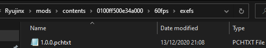
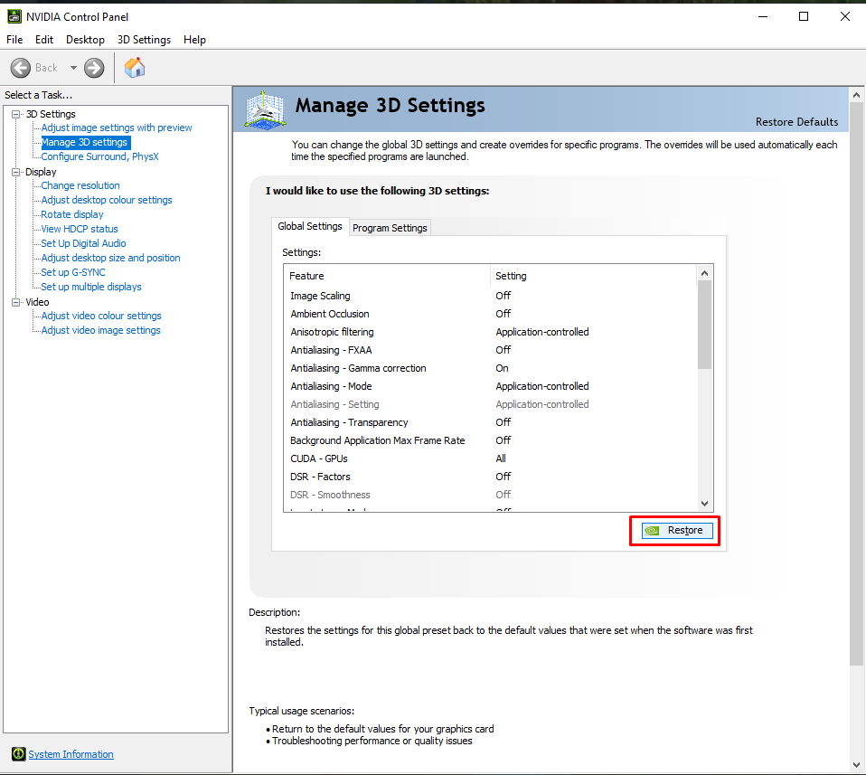
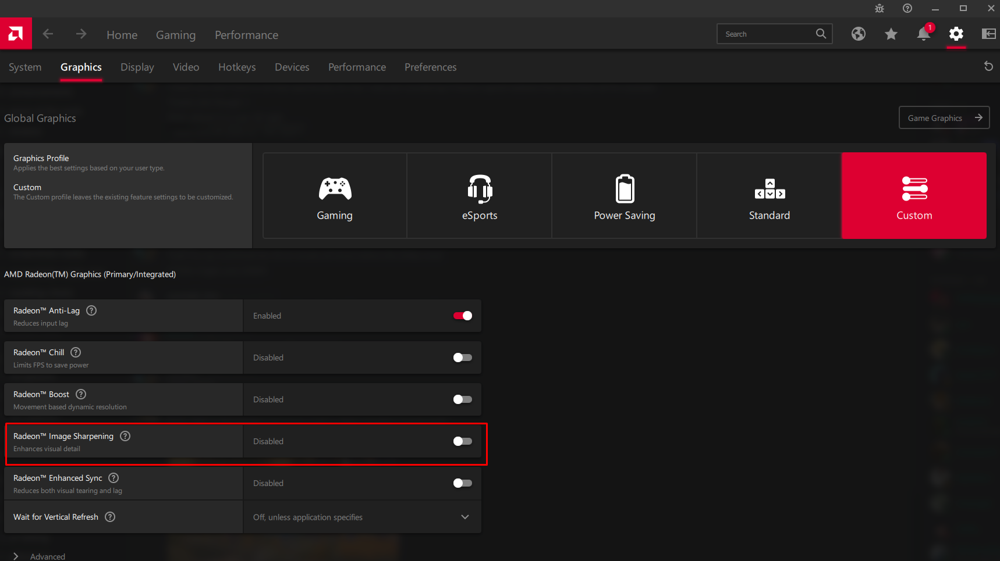
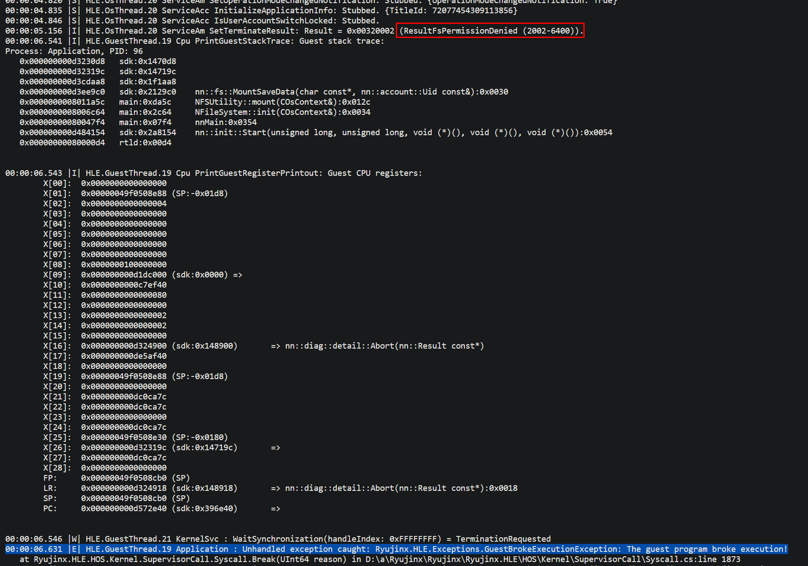

This is an assortment of the most common questions and issues Ryujinx users are having as of this document's latest revision date.

Press `CTRL+F` or `F3` and search for any keywords or errors you may be interested in. If your question, error or issue is not addressed here, please [join Discord](https://discord.gg/ryujinx) and we’ll answer it there, and perhaps add it to this page.

## Table of Contents

[Frequently Asked Questions](#frequently-asked-questions)

[Common Errors and Troubleshooting](#common-errors-and-troubleshooting)

[Game-Specific Errors and Troubleshooting](#game-specific-errors-and-troubleshooting)
 

## Frequently Asked Questions

### **• Where's the prod.keys file?/Where can I download [game]?**
**We do not support piracy.** It is forbidden to request copyrighted content (Firmware/Games/Keys/Shaders) on our repositories or on the Ryujinx Discord.

### **• Do I need a Switch to use this emulator?**
Ryujinx emulator is capable of running many homebrew applications, and can be a crucial tool in the development and debugging of homebrew applications and games. To play commercial games, you will need access to a Switch compatible with custom firmware (CFW), which will enable you to dump your system firmware, keys and legally purchased games.

### **__• What does "dumping" mean?__**
In this context, to dump files is to transfer them from your hacked Nintendo Switch to your PC, using either a microSD card or a USB-C cable.

### **__• How can I dump my firmware/games/keys?__**
First, you need to hack your Nintendo Switch, which you can learn how to do here: [https://nh-server.github.io/switch-guide/](https://nh-server.github.io/switch-guide/).

Once you have hacked your Switch, [backed up your keys](keys.md)
and [dumped your firmware](https://github.com/ryujinx-mirror/ryujinx/wiki/Firmware-Dumping-Guide-(TegraExplorer-or-hbmenu-&-Goldleaf)),
you may use the [nxdumptool homebrew](https://github.com/DarkMatterCore/nxdumptool/releases) on your Switch to dump your games, updates and DLC files.

### **__• Why use an emulator if I already have a Switch?__**
1. To play in 4K/higher resolutions than the Switch.
2. Allows multiple different controllers to be used.
3. Smoother/higher FPS with good enough hardware.
4. Play over the internet with LDN on games that support local wireless.
5. Modding games is faster and easier than on Switch.
6. Don't need a capture card to stream or record.
7. Easily use older updates of games you've dumped before if something you want gets patched.
8. Convenience: you avoid having several consoles plugged in and switching between them to play what you want.
9. Years down the line, online shops and services will close, and hardware will start breaking down, but emulation and digital dumps won’t; in the future, the console and its games will be preserved digitally thanks to Ryujinx and your game backups that you created in the present, even after the system is long dead and your console has become a paperweight.

### **__• How well does [game] run on Ryujinx?__**
You can find compatibility reports here: [https://github.com/ryujinx-mirror/ryujinx-Games-List/issues](https://github.com/ryujinx-mirror/ryujinx-Games-List/issues)

If you wish to contribute, you can open a new issue if the game has never been added, or you can add your test results as a comment on a game's issue for it to be merged into the top post, as long as it contains all the necessary information.

### **__• What are the optimal best settings?__**
Default settings and Vulkan if your GPU supports it. Ryujinx works out of the box and is already on the best settings by default.

You can of course tinker with the graphics settings (resolution, antialiasing, scaling filter, anisotropic filtering) so you can achieve the proper image quality for your setup, but **you shouldn’t change anything else** unless specified in compatibility entries or instructed by a staff member. You’re very likely to make performance worse (and in a few cases, crash) if you do.

### **__• I have no idea what I'm doing. How do I Ryujinx?__**
Follow the Ryujinx Setup & Configuration Guide:[ https://github.com/ryujinx-mirror/ryujinx/wiki/Ryujinx-Setup-&-Configuration-Guide](https://github.com/ryujinx-mirror/ryujinx/wiki/Ryujinx-Setup-&-Configuration-Guide) or see the Readme:[ https://github.com/ryujinx-mirror/ryujinx/blob/master/README.md](https://github.com/ryujinx-mirror/ryujinx/blob/master/README.md) .

If you are still having trouble, please visit a support channel on our [Discord Server](https://discord.gg/VkQYXAZ) and we will be happy to assist.

### **__• How do I add games to Ryujinx?__**
Add a games directory in `Settings` > `User Interface` > `Game Directories` > `Add`.

The games don’t have to show up on the window where you are selecting the folder, as it’s looking for folders, not game files.

If after selecting the correct game directory your games still do not show up on the main Ryujinx window, either your games aren’t in the correct format or you’ve chosen the wrong directory.

### **__• How can I use a single joycon/DS4/DS5/PS4/PS5/Pro Controller/Xbox controller on Ryujinx?__**
All of these controllers are supported natively. Simply head to `Options` > `Settings` > `Input` > `Player 1` > `Configure`, select your gamepad from the `Input Device` dropdown, click `Load` top right, then click `Save`.

### **__• How can I use dual joycons on Ryujinx?__**
You need [DS4Windows](https://github.com/Ryochan7/DS4Windows/releases/) for the joycon pair to show up on Ryujinx (they will be an "Xbox" controller under input devices). On DS4Windows, select joycon support and enable the UDP server for motion controls.

### **__• How can I use a GameCube controller on Ryujinx?__**
You will need [Delfinovin](https://github.com/Struggleton/Delfinovin).

If your joysticks don’t work, spin them for a bit until they do.

### **__• How can I play with mouse and keyboard controls?__**
Mouse controls are not currently supported. You can make do with something like mouse2joy or reWASD, but the vast majority of our users have preferred controller gyro over this workaround.

### **__• How can I unbind a button/key?__**
Left click on the binding then press middle click on your mouse.

### **__• Help! Why is the emulator crashing?__**
Refer to the [troubleshooting](#common-errors-and-troubleshooting) and [game-specific](#game-specific-errors-and-troubleshooting) sections below.

If you can’t find your issue in this page: join our [Discord server](https://discord.gg/ryujinx), provide an explanation of the issue and upload a .log file to the appropriate support channel. Our staff will take a look and give you some pointers on what's going wrong.

### **__• How can I lower the resolution?__**
Disable docked mode or set a custom resolution multiplier of 0.xx (for example: `0.75`) or 0,xx (`0,75`), depending on what your language uses.

Though if you’re trying to improve performance by doing this, keep in mind it will only work in the unlikely scenario that your GPU is the bottleneck. The vast majority of the time, emulation is CPU-bottlenecked, as it mostly runs on CPU.

### **__• Game runs really slow for me. What can I do to increase the FPS?__**
Make sure your graphics card drivers and Ryujinx are up to date.

If you have an AMD or Intel graphics card, you should always use the Vulkan backend instead of OpenGL. You may also dual boot Linux if you're still experiencing issues, as Mesa drivers are usually less buggy than AMD/Intel Windows drivers.

You may also be experiencing shader compilation stuttering (see the below answer), in which case, the more you play, the less of a problem it’ll be, as the shader cache will build up and the stutters will slowly go away.

If your game is still slow, you might need to get a better PC or wait for emulator optimizations.

### **__• What are shaders and why do I need them?__**
Shaders are small programs used in videogame rendering. In modern emulation (and even some PC games), every time a new model or effect shows up on screen, its shader needs to be compiled (read: translated) for your GPU. While the shader is being compiled, the game needs to pause, which you will know as shader compilation stuttering. Once the shader has been compiled, it gets stored in a shader cache, which will ensure you don’t stutter the next time that shader comes up.

Unfortunately, shader compilation is not easy to circumvent. Vulkan is significantly faster at shader compilation than OpenGL thanks to SPIR-V, Vulkan's shader backend. On first runs we recommend letting games play out opening cutscenes and then restarting, or running anything that makes them play themselves, such as automatic racing in MK8 or bot matches in SSBU. This will compile some shaders and, with a fast enough CPU and Vulkan, the hiccups will be greatly reduced.

### **__• How do I enable asynchronous shader compilation/async shaders?__**
Asynchronous shader compilation introduces graphical glitches, which sometimes don’t go away until a restart, and does not actually eliminate stuttering completely; as such, the Ryujinx developers have no plans to implement this feature. However, outside contributors are welcome to write and open a pull request for it, and it will be reviewed, approved and added to the main builds if it's up to Ryujinx standards.

### **__• Why is my game 30fps?__**
Because the game you're playing is a 30fps game.

### **__• How do I uncap the framerate?__**
`F1` uncaps fps, or `Tab` if you have an older install. You can also click `Vsync` at the bottom left of the status bar in windowed mode.

### **__• But now my game is going too fast! How do I make it normal speed?__**
The vast majority of Nintendo Switch games have their physics and speed tied to the framerate, and as such, increasing the framerate increases the game speed. In these cases, you need to find a 60fps mod (or whatever target you want; some 120fps mods exist) for your specific game.

You also have to keep in mind that these mods may be static, which means going under the target may cause the game to run in slow motion. If your hardware can’t run a game at that target, you will be better off not using framerate mods.

### **__• How do I install mods for a game?__**
Right click the game > `Open Mods Directory`. Extract your mods here. Folder structure should be `Ryujinx` > `mods` > `contents` > [game ID] > [mod name] > `exefs` or `romfs` > mod files.

Afterwards, right click the game and click on `Manage Mods` to ensure that the mods are enabled before playing.

If the mods don't work in-game, they are most likely not for your version of the game.

### **__• How do I install cheats for a game?__**
Right click the game > `Open Mods Directory`. Create a folder named `Cheats`, and inside it, create a .txt file with the first 16 characters of the game version’s build ID as the file name. The BID is usually mentioned somewhere in the same page as the cheats themselves, but if you can't find it, it can be obtained from the cheat manager. 

Open the .txt file and add your cheats into it. Afterwards, right click the game > `Manage Cheats` and enable the ones you want to use. You can also manage them during gameplay by going into `Actions` > `Manage Cheats`.

If the cheats don't work in-game, they are most likely not for your version of the game.

### **__• What are the hotkeys/"keyboard shortcuts" in Ryujinx?__**
- `ESC` exits the emulation.
- `F1` toggles Vsync (read: framerate cap).
- `F2` toggles mute/unmute.
- `F4` unhides the UI. It doesn’t hide it so as to avoid accidents.
- `F5` pauses and unpauses emulation.
- `F8` takes a screenshot at the internal resolution the game is rendering at (and not at the screen resolution). The screenshots are saved in your system’s pictures folder (ex. `C:\Users\yourname\Pictures\Ryujinx`) or in `portable\screenshots` if you’re using a portable install.
- `F9` toggles docked/handheld mode.
- `F11`/`Alt+Enter` toggles fullscreen.

There are also hotkeys for increasing and decreasing resolution scaling, and increasing and decreasing sound volume, but they are unbound by default. Most of these are exposed and configurable in the Avalonia UI, and there's an [open pull request](https://github.com/ryujinx-mirror/ryujinx/pull/4503) to add the remaining ones.

### **__• What is Avalonia?__**
Avalonia is a user interface framework. We have been developing a new Avalonia-based UI for quite some time now, and we plan to completely remove the old GTK UI soon.

### **__• Where can I try this Avalonia thing?__**
As of 1.1.1217, Avalonia has become the default UI.

### **__• Does Avalonia autoupdate?__**
Yes.

### **__• How do I update the emulator?__**
Click on `Help` then `Check for Updates`.

### **__• How do I report a bug?__**
If you've found a bug, please first make sure it's not been reported on the [main issue tracker](https://github.com/ryujinx-mirror/ryujinx/issues) or on the [game compatibility list](https://github.com/ryujinx-mirror/ryujinx-Games-List/issues). Then post a comment in the game's compatibility entry with a screenshot, a log and a save file, along with an explanation on how to reproduce the issue. This allows our developers to quickly look into bugs, without having to worry about how to reproduce them.

### **__• How well does Ryujinx run on macOS?__**
Apple Silicon macOS devices, such as the M1 or M2, can run Ryujinx with good playability across many titles.

Intel Macs have a lot more issues due to old, deprecated drivers or unsupported hardware. A lot of integrated Intel GPUs (5th gen or older) don’t support the necessary Vulkan featureset to work.

On Intel Macs with AMD GPUs or newer Intel iGPUs, you likely want to either dual boot Linux or use Boot Camp to run Windows, as macOS drivers for these graphics cards leave much to be desired.

Keep in mind Ryujinx needs bare metal access, so it won't run on a VM without some kind of GPU passthrough.

### **__• Can I run Ryujinx on iPhone/iPad/iOS?__**
No. iOS heavily restricts JIT, does not completely support .NET runtime and does not give apps sufficient RAM to run something such as Ryujinx, plus sideloading has plenty of issues, among other things. The iOS space needs to change significantly before Ryujinx on iOS is even a consideration.

### **__• Can I run Ryujinx on Android?__**
No. While we would love to see Ryujinx on Android devices, our priorities currently lie in improving the core experience for Windows, Linux and macOS users.

### **__• Can I run Ryujinx on Xbox Series X?__**
No. It requires a DirectX renderer, which Ryujinx does not have at the moment. There are also RAM limitations and some graphics features that Ryujinx needs aren’t supported on DirectX, among other things.

### **__• When is [feature] coming?__**
We don’t like giving ETAs, as all of our developers work on Ryujinx in their free time, and you can never know when something will be entirely ready in open source projects in general.

If you would like to help speed up the process, we currently have a [Patreon](https://www.patreon.com/ryujinx/membership) goal that, when reached, will help gdkchan, the main developer and project lead, to become a full-time developer.

### **__• Has [feature] been implemented/[bug] been fixed yet?__**
You can search for it by pressing `CTRL+F` or `F3` on our changelog page: https://github.com/ryujinx-mirror/ryujinx/wiki/Changelog

### **__• How can I create a Mii?__**
`File` > `Load/Open Applet` > `Mii Editor`. You can’t create them from in-game as Ryujinx doesn’t support loading applets during gameplay yet.

### **__• How can I use an Amiibo?__**
Go in-game to where it asks you to scan one, then click on `Actions` > `Scan an Amiibo`.

### **__• Where can I find a game's save files?__**
Once you have [added a games directory](https://github.com/ryujinx-mirror/ryujinx/wiki/FAQ-and-Troubleshooting#-how-do-i-add-games-to-ryujinx), right click a game and select `Open User Save Directory` or `Open Device Save Directory`. Most games utilise a user save, but some games use a system save; for example Animal Crossing.

Save files are all compatible across Switch devices and all Switch emulators, so you may copy and paste them anywhere and they will still work.

### **__• Where can I find ALL game save files?__**
`C:\Users\yourname\AppData\Roaming\Ryujinx\bis\user\save\` or `\portable\bis\user\save` if you're on a portable install.

### **__• Why are the save folders all sorted by some weird numerical order instead of having their game IDs?__**
This is how the Switch itself does it. We are merely trying to emulate the Nintendo Switch filesystem properly.

### **__• Can I extract data from a game using Ryujinx?__**
Once you have [added a games directory](https://github.com/ryujinx-mirror/ryujinx/wiki/FAQ-and-Troubleshooting#-how-do-i-add-games-to-ryujinx), right click on a game > `Extract Data`, choose the section you want to extract, then select the folder you want to extract it to.

DLC data is NOT extracted currently.

### **__• Why is the option to extract data greyed out?__**
It's disabled on the LDN builds. Use the main Ryujinx build.

### **__• What is FIFO% and how do I lower it?__**
FIFO (First In First Out) is the emulated GPU's command queue. Higher percentage means the commands are taking longer to be processed by your CPU/Ryujinx, lower percentage means the command queue is not the limiting factor. The acronym describes the order in which the commands are processed.

To reiterate, this is **not** GPU usage, it's the emulated Nintendo Switch's GPU commands, which are processed by your CPU (as is most of the stuff in an emulator) and then fed to your GPU in order to present an image.

### **__• How does CPU usage work in Ryujinx?__**
Ryujinx has 1:1 guest to host threads (but a scheduler keeps only one active per 4 cores at a time), there is one GPU command processing thread, there is optionally one GPU backend thread, there are up to 8 shader background compile threads, there is a dynamic number of JIT highcq background threads, and there are an unbounded number of ASTC decompression threads.

### **__• How do I build a PR?__**
To build a pull request, first of all [download and install the .NET SDK](https://dotnet.microsoft.com/en-us/download/dotnet/7.0). Go to the top of the PR > click the link after "from" (ex. `gdkchan:true-gmem`), click the green `<> Code` button > `Download ZIP`, extract it, open the extracted folder, `shift+right click` on an empty area of the folder, then click `Open PowerShell window here`, type `dotnet publish -c Release` and click `Enter`. After it’s done, the window will say where it put the files. If you still can’t find them, search for `Ryujinx.exe`, or `Ryujinx.Ava.exe` for the Avalonia build.

### **__• How do I play online multiplayer?__**
With our LDN build, which allows playing games that feature local wireless or local play, simulating 2 consoles being within close proximity to each other, with other Ryujinx LDN players over the Internet.

See the Multiplayer Guide here:[ https://github.com/ryujinx-mirror/ryujinx/wiki/Multiplayer-(LDN-Local-Wireless)-Guide](https://github.com/ryujinx-mirror/ryujinx/wiki/Multiplayer-(LDN-Local-Wireless)-Guide)

### **__• When I click on connect to the internet, Ryujinx doesn’t connect?__**
See the multiplayer guide above. You’re not supposed to click on anything that mentions “online” or “the internet” in-game as that leads to Nintendo servers; you’re supposed to find the local play/local wireless/play locally option, which is then used to connect over the internet with other Ryujinx users.

### **__• What multiplayer modes does Ryujinx support and what are the differences between them?__**
**LDN**/local wireless/local play is an ad-hoc WiFi connection between 2 or more consoles in close proximity. [A ton of games](https://github.com/ryujinx-mirror/ryujinx/wiki/Multiplayer-(LDN-Local-Wireless)-Guide#how-to-play-ldn) have this on the Switch. We use this to connect Ryujinx instances over the internet.

**ldn_mitm** makes LDN/local wireless/local play behave as if it were LAN, allowing for same-network (local) connections. This can be used to connect Ryujinx with hacked consoles that have [ldn_mitm](https://github.com/spacemeowx2/ldn_mitm/releases) installed on them. If you use [XLink Kai](https://www.teamxlink.co.uk/wiki/Ryujinx_XLink_Kai_Setup), you can connect via ldn_mitm with other Ryujinx and hacked Switch consoles through the internet, not just locally.

**LAN** is 2 or more systems connecting through an access point locally. About [15 games](https://github.com/ryujinx-mirror/ryujinx/wiki/Multiplayer-(LDN-Local-Wireless)-Guide#lan-mode-games) have this on the Switch. Games with a LAN mode can connect with **any consoles or Ryujinx instances** on the same network. If you use [XLink Kai](https://www.teamxlink.co.uk/wiki/Ryujinx_XLink_Kai_Setup) or a VPN like [Zerotier](https://www.zerotier.com/download/), you can connect LAN games across any Ryujinx instances, Switch consoles and other emulators through the internet, not just locally.

Nintendo Switch Online is not supported. Custom servers that replicate Nintendo Switch Online are not supported.

### **__• How can I connect Ryujinx to a Switch?__**
Read the above answer, specifically the LAN and ldn_mitm parts.

Hacked consoles can use both LAN and ldn_mitm. To connect with unhacked consoles, the game needs to include a LAN mode. At the time of writing, only [a handful of games](https://github.com/ryujinx-mirror/ryujinx/wiki/Multiplayer-(LDN-Local-Wireless)-Guide#lan-mode-games) support LAN mode on Switch; if the game you’re playing is not one of them, **you can’t connect them to an unhacked Switch** yet. It may become possible in the future.

### **__• Can I play online with my friend who’s using a Nintendo Switch?__**
See the previous two answers. To play with a Nintendo Switch over the internet, you’re gonna need XLink Kai or a VPN like Zerotier, and also, if the game doesn’t have a LAN mode, the Nintendo Switch will need to be hacked as you will need to use ldn_mitm. There is currently no way to hook up a Nintendo Switch console to Ryujinx’s LDN servers. However, in the future it may be possible to connect a PC to an unmodded Switch via LDN locally, without the need for ldn_mitm.

### **__• Can I trade Pokémon between Ryujinx and my Switch?__**
If the Switch isn't hacked, you can only do it on Pokémon Sword and Shield. However, an update to the game (not to Ryujinx) broke LAN mode, and it only works for a select lucky few.

### **__• Why do we keep disconnecting?__**
Some games are extremely finicky and will disconnect the moment anyone’s framerate drops, like Mario Kart 8 Deluxe. This includes shader compilation stuttering, so every player will have to play through every track in single player mode first, in order to cache shaders, and also ensure that they can maintain 60fps on every stage. Remember to keep Vsync enabled as well, since it acts as a framelimiter.

### **__• I’m playing with a friend and why is it so laggy?__**
Real world distance still applies, so if you’re in different continents or just really far away from each other on the Earth, then you will have the corresponding latency.

It can also be that a P2P connection was not formed and you’re connecting via the master server, which will of course increase latency as well. If this is happening, you can try connecting using ldn_mitm in conjunction with either XLink Kai or a VPN like Zerotier, which would allow you to connect to each other directly.

If you’re playing Super Smash Bros. Ultimate, the game has latency baked into it and pretty bad netcode. Most Smash players use Parsec instead of LDN to play together, so you could try that instead.

### **__• What does LDN stand for?__**
Nobody actually knows, but our best guess is “Local Direct Network” or "Local Distance Network". Nintendo internally refer to local wireless functionality as “LDN”, but the full name is never used.

### **__• Can I make Ryujinx into a portable install?__**
Yes! See the [portable mode quick reference guide](https://github.com/ryujinx-mirror/ryujinx/wiki/Ryujinx-Setup-&-Configuration-Guide#portable-mode).

### **__• What’s a portable install?__**
By default, Ryujinx uses your `C:\Users\yourname\AppData\Roaming\Ryujinx` directory for storing firmware, keys, save files, configs, caches etc. If you make a folder named `portable` in the same directory as the Ryujinx executable, the emulator will use that folder instead of the AppData one to store all those files. This is useful if you would like to keep everything in one place, or to avoid settings resetting or shaders constantly rebuilding if you’re testing multiple different Ryujinx versions.

### **__• How can I support Ryujinx?__**
There are many ways to support or contribute to Ryujinx. You can support us through Patreon (https://www.patreon.com/ryujinx) or you can boost the server with Discord Nitro. If you know how to help somebody in support, you can help us by answering questions there. You can help with testing future changes to the emulator in Discord’s #pr-testing channel or in a PR’s discussion page as well.

If you are a developer, there are [Good First Issues](https://github.com/ryujinx-mirror/ryujinx/issues?q=is%3Aissue+is%3Aopen+label%3A%22good+first+issue%22) listed on our issue tracker. We do encourage you to talk to some devs in our Discord’s development channel before setting off, so we can confirm your work isn't conflicting with another user's, and so we can help you get used to the codebase and what needs to be done with various issues.

## **Common Errors and Troubleshooting**

Most of the errors below will be displayed on the console or log files. To view your log files, go to `File` > `Open Logs Folder`. You’ll likely want to open the biggest and latest one of the 3 files.

### • Can’t open Ryujinx: `|E| Application : Unhandled exception caught: System.TypeInitializationException: The type initializer for 'Gtk.Application' threw an exception. ---> System.DllNotFoundException: Gtk: libgtk-3-0.dll, libgtk-3.so.0, libgtk-3.0.dylib, gtk-3.dll`
This error is specific to the old GTK UI. As of 1.1.1217, Avalonia has become the default, so please redownload Ryujinx if possible. If you're on an old, unsupported version:

Some emulator files are missing. Redownload Ryujinx, make sure it’s extracted properly and don’t put it on the desktop or the root of a drive, as those are protected folders. Third party antivirus software can also randomly delete these files, so if you have one, make exceptions for Ryujinx or uninstall the antivirus.

### • Can’t open Ryujinx: `|E| Application : Unhandled exception caught: GLib.GException: Unrecognized image file format   at Gdk.PixbufLoader.Write(Byte[] buf, UInt64 count)`
Similar to the above, Ryujinx is most likely in a protected folder. Move it somewhere else.

### • Can’t open Ryujinx, console closes without any errors and without opening the main window:
Ensure Ryujinx is not on the desktop or a protected folder and that you don't have any third party antivirus software. This issue has also been reported to have been caused by "defender omega" controllers, so disconnect it if you have one.

### • Crashing after selecting Vulkan, trying to open settings or booting a game using Vulkan with `|E| GUI.RenderLoop Application : Unhandled exception caught: Ryujinx.Graphics.Vulkan.VulkanException: Initialization failed, none of the available GPUs meets the minimum requirements.   at Ryujinx.Graphics.Vulkan.VulkanInitialization.FindSuitablePhysicalDevice(Vk api, Instance instance, SurfaceKHR surface, String preferredGpuId) in D:\a\Ryujinx\Ryujinx\Ryujinx.Graphics.Vulkan\VulkanInitialization.cs:line 217`
If you have a system consisting of an AMD Ryzen CPU with an AMD Radeon iGPU (4600H, 4800H, 5600H etc) and an Nvidia dGPU, you need to update **BOTH** graphics card drivers from their respective websites. Not just the dedicated Nvidia one, and not just from Windows update.

https://www.amd.com/en/support

https://www.nvidia.com/download/index.aspx

If your hardware doesn’t match the above, it’s possible your GPU drivers are simply out of date. In the case that they aren’t, your GPU might not meet the minimum requirements to run Ryujinx, for example any Intel iGPUs 5th gen or older.

### • Crashing after selecting Vulkan, trying to open settings or booting a game using Vulkan with `|E| GUI.RenderLoop Application : Unhandled exception caught: System.NullReferenceException: Object reference not set to an instance of an object.   at Ryujinx.Graphics.Vulkan.CommandBufferPool.AddWaitable(Int32 cbIndex, MultiFenceHolder waitable) in D:\a\Ryujinx\Ryujinx\src\Ryujinx.Graphics.Vulkan\CommandBufferPool.cs:line 147`
Same as above.

### • `|E| GUI.RenderThread Application : Unhandled exception caught: Ryujinx.Graphics.Vulkan.VulkanException: Unexpected API error "ErrorFeatureNotPresent".`
Similar to the issue above, the emulator cannot detect a graphics card with Vulkan support. Check that your GPU drivers are on the latest possible version, and if they are, then unfortunately your GPU doesn’t meet minimum requirements.

### • `|E| GUI.RenderLoop Application : Unhandled exception caught: System.IO.FileNotFoundException: Could not find or load the native library: vulkan-1.dll Attempted: "vulkan-1.dll", "C:\Users\pc\Desktop\publish\vulkan-1.dll"   at Silk.NET.Core.Loader.LibraryLoader.ThrowLibNotFound(String name, PathResolver resolver)`
Similar to the issue above, the emulator cannot detect a graphics card with Vulkan support. Check that your GPU drivers are on the latest possible version, and if they are, then unfortunately your GPU doesn’t meet minimum requirements.

### • `|E| GUI.RenderLoop Application : Unhandled exception caught: System.NotSupportedException: No supported Vulkan surface found!   at SPB.Graphics.Vulkan.VulkanHelper.EnsureInit()`
Similar to the issue above, the emulator cannot detect a graphics card with Vulkan support. Check that your GPU drivers are on the latest possible version, and if they are, then unfortunately your GPU doesn’t meet minimum requirements.

### • Crashing after double-clicking any game with `(Ryujinx:18152): Gtk-CRITICAL **: 00:44:23.202: gtk_list_store_get_value: assertion 'iter_is_valid (iter, list_store)' failed   00:00:00.058 |I| Gpu : Backend Threading (Auto): True   Marshaling row-activated signal   00:00:00.265 |E| Application : Unhandled exception caught: System.Reflection.TargetInvocationException: Exception has been thrown by the target of an invocation. ---> System.NullReferenceException: Object reference not set to an instance of an object.   at Ryujinx.Ui.MainWindow.LoadApplication(String path, Boolean startFullscreen) in D:\a\Ryujinx\Ryujinx\Ryujinx\Ui\MainWindow.cs:line 718`
This error is specific to the old GTK UI. As of 1.1.1217, Avalonia has become the default, so please redownload or update Ryujinx if possible. If you're on an old, unsupported version:
If the error looks like this, click the game once then press `Enter` or use the Avalonia UI. 

### • Crashing after booting a game or crashing after applying an update with `|E| HLE.OsThread.8 Application : Unhandled exception caught: System.Reflection.TargetInvocationException: Exception has been thrown by the target of an invocation. ---> LibHac.Common.HorizonResultException: ResultFsNonRealDataVerificationFailed (2002-4604): Hash error!`
Your game file, update file or both are corrupted/invalid, you need to [dump](https://github.com/ryujinx-mirror/ryujinx/wiki/FAQ-and-Troubleshooting#-what-does-dumping-mean) them again and [ensure nothing goes wrong in the process](https://github.com/ryujinx-mirror/ryujinx/wiki/FAQ-and-Troubleshooting#-game-hangs-on-boot-log-says-e-loader-loadnca-no-exefs-found-in-nca).
- If removing the update works, it's the update file that is corrupted.
- If the error still occurs, it's the game file that is corrupted.

### • `|E| Application : Unhandled exception caught: LibHac.Common.HorizonResultException: ResultFsPartitionSignatureVerificationFailed (2002-4644): Invalid Partition FS type "????"   at LibHac.Common.ThrowHelper.ThrowResult(Result result, String message)`
Similar to the above error, the file you’re trying to load is not a supported file type or may be corrupt.

### • Crashing after booting a game with `|E| Application : Unhandled exception caught: System.Reflection.TargetInvocationException: Exception has been thrown by the target of an invocation. ---> LibHac.Common.HorizonResultException: ResultFsPathNotFound (2002-0001)`
You might be running an update file instead of a game file. See [here](https://github.com/ryujinx-mirror/ryujinx/wiki/Ryujinx-Setup-&-Configuration-Guide#managing-game-updates) for how to properly update a game.
Another possible cause is Ryujinx might be forbidden from accessing the save folder for this game. This can be either due to a permission issue, for instance, from being placed on the desktop, the root of a drive or any kind of protected folder; or due to an antivirus not allowing the files to be accessed by the emulator.

### • Crashing with `|E| HLE.OsThread.8 Application : Unhandled exception caught: System.Reflection.TargetInvocationException: Exception has been thrown by the target of an invocation. ---> System.IO.FileNotFoundException: System archive with titleid 0100000000000823 was not found on Storage BuiltInSystem. Found in None.`
Your firmware is too old to run the game you’re trying to run, and it tried to use files that don’t exist in such an old version. Update your keys and firmware.

### • “Ryujinx has encountered an error: System update title was not found in the firmware package.”
The file you're trying to install as a firmware does not contain actual firmware. See the [firmware dumping guide](https://github.com/ryujinx-mirror/ryujinx/wiki/Firmware-Dumping-Guide) for how to dump yours.

### • “RYU-0003: Firmware parsing error Ryujinx was unable to parse the provided firmware. **_This is usually caused by outdated keys_**.”
The error itself tells you. Firmware and keys go hand in hand; if you update your firmware, you need to update your keys too.

### • Crashing on boot with `|E| HLE.OsThread.8 Application : Unhandled exception caught: System.Reflection.TargetInvocationException: Exception has been thrown by the target of an invocation. ---> LibHac.Common.Keys.MissingKeyException: Missing NCA title key.`
Similar to the above; redump and update your keys.

### • Crashing on boot with `|E| HLE.OsThread.8 Application : Unhandled exception caught: System.Reflection.TargetInvocationException: Exception has been thrown by the target of an invocation. ---> LibHac.Common.Keys.MissingKeyException: Unable to decrypt title key.`
Similar to the above; redump and update your keys.

### `|E| HLE.OsThread.8 Application : Unhandled exception caught: System.Reflection.TargetInvocationException: Exception has been thrown by the target of an invocation. ---> System.Collections.Generic.KeyNotFoundException: The given key 'None' was not present in the dictionary.`
Similar to the above; redump and update your keys.

### • `|N| Application : Unhandled exception caught: System.Reflection.TargetInvocationException: Exception has been thrown by the target of an invocation. ---> LibHac.Common.Keys.MissingKeyException: Unable to decrypt NCA section.`
Similar to the above; redump and update your keys.

### • Can’t open settings/crashing with `|E| Application : Unhandled exception caught: System.Reflection.TargetInvocationException: Exception has been thrown by the target of an invocation. ---> System.ArgumentException: An item with the same key has already been added.`
Go to `C:\Users\yourname\AppData\Roaming\Ryujinx\bis\system\Contents\registered` (or `portable\bis\system\Contents\registered` if on a portable install) and delete the contents of the “registered” folder, then reinstall your firmware. If that doesn't work, redump/update your keys.

If you get this error but the below strings mention `PTC`, it means your PPTC is corrupted, in which case right click the game on the games list > `Cache Management` > `Queue PPTC Rebuild`.

### • Game hangs on boot, log says `|E| Loader LoadNca: No ExeFS found in NCA`
When dumping your game, enable “Remove console specific data”, “Generate ticket-less dump” and “Change NPDM RSA key/sig in Program NCA” in nxdumptool.

### • NSP file won't show on the main menu, loading it from file will hang the emulator and log the following warning: `|W| Loader GetNpdm: NPDM file not found, using default values!` followed by these errors:  `|E| Loader LoadNsos: Process initialization returned error "InvalidMemoryRegion".`  `|E| Loader TryLoad: Unable to load: Could not find Main NCA`
You're trying to load an update file instead of a game file. See [the setup guide](https://github.com/ryujinx-mirror/ryujinx/wiki/Ryujinx-Setup-&-Configuration-Guide#managing-game-updates) for how to properly update your games.

### • Ryujinx showing a black screen:
First, make sure that the game you are trying to run is actually supported and that your graphics card is capable of running it.

If you have an Nvidia GPU, go to the Nvidia control panel and click `Restore` to set it to default settings.

If you have an AMD or Intel GPU, update your GPU drivers and use the Vulkan graphics backend.

If you only have an Intel iGPU, make sure it's on a 6th-gen CPU or newer. Older Intel iGPUs do not support the necessary features to run Ryujinx.

If the problem persists, make sure that any external application that could affect rendering is disabled. This includes software which puts an overlay on top of the emulator display window, like the MSI Afterburner overlay or Twitch Studio.

### • Black screen with sound on Nvidia:
Restore your Nvidia control panel global settings to defaults.

### • Ryujinx window is transparent/see-through:
Disable sharpening under global graphics in the Radeon control panel.

### • Emulator window hanging/not responding after exiting a game:
Close the console window, it will also close the other one. If you’ve hidden the console, you’ll need to use the task manager to terminate the Ryujinx process. As of **1.1.848**, this should happen much less frequently.

### • Game crashes with `|E| GUI.RenderThread Application : Unhandled exception caught: Ryujinx.Graphics.Vulkan.VulkanException: Unexpected API error "ErrorOutOfDeviceMemory".`
This means your VRAM was exhausted. Check that your resolution scaling isn’t too high; 4x is overkill for virtually every setup.

If you’re playing Astral Chain, Bayonetta 3, Fire Emblem Engage, Metroid Prime Remastered, Super Mario Bros. Wonder or The Legend of Zelda: Tears of the Kingdom, you might need to enable texture recompression in graphics settings. This is because these games use ASTC textures, which are supported natively without needing to be decompressed on the Switch, but when decompressed on PC can become massive and take up a lot of VRAM.

If you’re playing other games and your resolution is on native, it might be an issue with emulating that particular game. Check the [game compatibility list](https://github.com/ryujinx-mirror/ryujinx-Games-List/issues) to see if it’s been reported, and if not, post a test result.

### • Game crashes with `|E| GUI.RenderLoop Application : Unhandled exception caught: Ryujinx.Graphics.Vulkan.VulkanException: Unexpected API error "ErrorDeviceLost".`
This is a generic Vulkan crash. There’s hardly any information that can be gleaned from it, and the solutions vary wildly from case to case, but most of the time it’s not something users can fix or workaround.

On Nvidia, some device loss crashes were introduced in driver version **527.37** (not just in emulated games; native PC games too) and, at time of writing, it seems drivers newer than this still have some problems. If you are on newer Nvidia drivers and can’t find any mention of these crashes in the compatibility list for your game, it might be worth downgrading the driver version.

On AMD and Intel GPUs, a bigger amount of games have this issue. If updating to the latest drivers doesn’t fix it, your best bet will be Linux and Mesa drivers.

### • Game crashing with `|E| HLE.GuestThread.19 Application : Unhandled exception caught: Ryujinx.HLE.Exceptions.GuestBrokeExecutionException: The guest program broke execution!   at Ryujinx.HLE.HOS.Kernel.SupervisorCall.Syscall.Break(UInt64 reason) in D:\a\Ryujinx\Ryujinx\Ryujinx.HLE\HOS\Kernel\SupervisorCall\Syscall.cs:line 1873`
This means the game itself crashed, and not the emulator. The cause could be a million different things; however the key for troubleshooting this is not in the error itself, but rather what comes before it.

As shown in this example, right before the “guest stack trace”, there will be a short error with a code at the end. There can be many of these as well, but we’ll cover the most common.

- `ResultFsPermissionDenied (2002-6400)` here usually means Ryujinx has been denied access to the save folder for this game. Most of the time it’s solved if you delete the save folder: Right click the game > `Open User Save Directory`. Backup the contents if you care about the save. Go up 2 levels and delete the selected folder. Run the game again. 
  - If this doesn’t fix it, check that Ryujinx isn’t on a protected folder (such as the desktop or the root of a drive) and that a third party antivirus (if you have one) isn’t blocking Ryujinx from using the save folder. If all else fails, make a portable install and bring over your caches and saves from the previous install.

- `ResultFsTargetNotFound (2002-1002)` might have the same causes and solutions as those described above.

- `ResultKvdbInvalidKeyValue (2020-0005)`, also similar to the 2 above errors, means the savedata index for the game isn’t found, so the savedata is corrupted. Try backing up and then deleting the game's savedata folders. If this doesn't solve it, backup your whole Ryujinx data folder (`C:\Users\yourname\AppData\Roaming\Ryujinx`, or the portable folder if you've made a [portable install](https://github.com/ryujinx-mirror/ryujinx/wiki/FAQ-and-Troubleshooting#-whats-a-portable-install)) and then delete it. Then restore the subfolders (caches, save files) you'd like to keep.

- `ResultFsOutOfRange (2002-3005)` usually indicates a bad dump (corrupt game files). If FS integrity checks is disabled and you are getting this error, enable it, run the game again and check if you now get a hash error as described [here](https://github.com/ryujinx-mirror/ryujinx/wiki/FAQ-and-Troubleshooting#-crashing-after-booting-a-game-or-crashing-after-applying-an-update-with-e-hleosthread8-application--unhandled-exception-caught-systemreflectiontargetinvocationexception-exception-has-been-thrown-by-the-target-of-an-invocation-----libhaccommonhorizonresultexception-resultfsnonrealdataverificationfailed-2002-4604-hash-error).

- `ResultErrApplicationAborted (2162-0001)` is as generic as it gets. Check your game’s compatibility list entry or the game-specific troubleshooting entry in this page if you get this.

### • Crashing with `Fatal error. System.AccessViolationException: Attempted to read or write protected memory. This is often an indication that other memory is corrupt.`
This is another generic error. It also doesn’t normally show on logs, only on the console when crashing. A possible cause is Ryujinx being in a protected folder or blocked by a third party antivirus. If this is not the case, check the compatibility page for your game.

If you're getting this error when running a game on Vulkan and the below strings mention SDL2, you need to uninstall Gshade or stop it from trying to hook onto Ryujinx. Similarly, if Ryujinx won't open and the below strings also mention SDL2, close Medal.

If you're getting this error on a Rog Ally, go to `Add or remove programs` on Windows and uninstall the "OpenCL, OpenGL, and Vulkan Compatibility Pack".

### • `|E| HLE.GuestThread.20 Cpu InvalidAccessHandler: Invalid memory access at virtual address 0x0000000000000000. |E| HLE.GuestThread.20 Application : Unhandled exception caught: Ryujinx.Memory.InvalidMemoryRegionException: Attempted to access an invalid memory region.`
Invalid memory access errors, especially ones with the `0x0000000000000000` address, are usually caused by mod or cheat conflicts. Check that any given 2 (or more) mods or cheats you’re using don’t modify the same game files, and remove them if they do. This error can also be caused by poorly-made mods that don’t work on Nintendo Switch hardware.

Be aware that disabled cheats are still loaded into memory, so that they can be enabled while the game is running; if you are getting this crash and only have cheats but no mods, the issue is likely a conflict among the cheats, **even if they’re disabled**.

### • Inconsistent frame pacing/frame times:
Disable Ryujinx vsync and cap the framerate externally via your GPU driver settings or RivaTuner Statistics Server. Note that this won’t work for all games; Super Smash Bros. Ultimate, for instance, speeds up even if you cap the framerate externally, as it relies on the vsync signal to determine game speed.

As of **1.1.739**, frametimes are considerably smoother.

### • Fullscreen framerate is not as smooth as on windowed mode/G-Sync not working:
On the Nvidia control panel, head to `Vulkan/OpenGL present method` and select `Prefer layered on DXGI Swapchain` to enable GSync on a GSync-compatible monitor.

### • RTSS/MSI Afterburner won’t hook to Ryujinx:
Open Ryujinx settings before running a game.

### • Controller buttons exit emulation/joystick moves cursor/mouse moves on its own/controller presses keyboard keys:
Shutdown Steam or disable the gamepad configurations you may have active on Steam.

### • Any kind of issue using DualShock 4, DualShock 5 gamepads:
Do not use Betterjoy or DS4Windows, they work with Ryujinx natively and external software may cause issues.

### • Instant communication error trying to play LDN: 
Make sure Ryujinx is allowed on your firewall. If it still occurs, disable P2P in multiplayer settings.

### • ldn_mitm won't connect/Ryujinx and Switch won’t see each other:
Both Ryujinx and the CFW Switch must be on the same network, timezone setting and game version. Check that Ryujinx is not being blocked by the firewall or a third party antivirus, that you're using a custom user profile on Ryujinx, that you’ve actually selected ldn_mitm in Ryujinx’s multiplayer settings, that you've enabled ldn_mitm on your Switch console and that no passphrase is being used. Try several times as well, since it doesn’t always work on the first attempt.

### • Game says save file is corrupted:
If the save is from a newer game version, trying to use it on an older update may cause the game to read it as corrupted. In this case simply exit the emulation and update the game.

If your PC shuts down unexpectedly (blue screen, power outage) while the game is running, the save file might also get corrupted. This is due to Windows keeping the file open at all times, and not just when the game is being saved. As a general rule of thumb, we recommend making frequent backups of your save files, in case something like this happens.

### • `|W| HLE.OsThread.10 ServiceNv Wait: GPU processing thread is too slow, waiting on CPU.`
The wording is a bit unclear. The error refers to the CPU thread that processes the emulated GPU being too slow, and **not** your GPU being too slow. This error mostly pops up during shader compilation, which is normal and you shouldn't worry about.

However, if you're getting it even with shaders cached, that may mean your CPU is a tad slower than what is recommended to run Ryujinx properly.

### • `|W| GPU.MainThread Gpu Log: Shader translator: Shader instruction Votevtg is not implemented` ///`|E| GPU.MainThread Gpu GetInfo: Invalid texture format 0x7FFFF (sRGB: False).`
These are both errors that don’t actually affect how any game runs and are safe to ignore.

### • Crashing with `|E| HLE.OsThread.6 Application : Unhandled exception caught: System.Reflection.TargetInvocationException: Exception has been thrown by the target of an invocation. ---> System.ArgumentException: No valid channel configuration found!`
Change your audio backend to SDL2 or OpenAL. SoundIO can cause this crash in certain situations.

### • Updated Ryujinx and it didn’t restart when clicking “Yes”:
If you are on Windows 11, Windows Command Line needs to be set to `Windows Console Host` instead of `Windows Terminal` for it to work.

### • Ryujinx executable disappeared/deleted itself after updating:
Redownload the emulator and do not update while a game is running or settings are open. Do not extract it to a protected folder such as the desktop. Make exceptions for or uninstall any third party antivirus you might be using.

### • Updated Ryujinx and now the executable/all my files are gone/named “.ryuold”:
Simply head to the website, download the latest version and delete the Ryujinx folder that failed to update, with care not to delete your `portable` folder if you have one.
This may happen if you update while a game is running or while emulator settings are open, if you have a third party antivirus falsely flagging Ryujinx upon updating or if you have Ryujinx on a protected folder, such as the desktop or the root of a drive.

### • Can’t connect to the internet/Error Code: 2306-0520 Unable to connect to the Internet. The DNS settings or proxy server may have been entered incorrectly:
Read [here](https://github.com/ryujinx-mirror/ryujinx/wiki/FAQ-and-Troubleshooting#-what-multiplayer-modes-does-ryujinx-support-and-what-are-the-differences-between-them). Ryujinx does not support connecting to Nintendo Switch Online (NSO). Any options in a game that prompt you to connect to the internet will almost assuredly try to connect to Nintendo servers, which will not work. 

If you are trying to play multiplayer with other Ryujinx users, you will want [local wireless/local play/play locally](https://github.com/ryujinx-mirror/ryujinx/wiki/Multiplayer-(LDN-Local-Wireless)-Guide), which despite the name will work over the internet. If you are trying to play with Nintendo Switch users, you want LAN mode in games that support it, or ldn_mitm which will allow playing with consoles via LDN, though only if they’re hacked.

### • Experiencing audio delay after playing for over an hour:
Pause and unpause emulation (`F5` by default). You may also try changing your audio backend to OpenAL if you're on SDL2.

### • Antivirus flagged Ryujinx as `FileRepMalware`:
Uninstall Avast. Ryujinx is safe as long as you downloaded it from our GitHub or official downloads.

### • Games not loading/freezing after loading caches/PPTC:
Uninstall AVG. Ryujinx is safe as long as you downloaded it from our GitHub or official downloads.

### • Updated Ryujinx and now every game is crashing with `|E| Application : Unhandled exception caught: System.Reflection.TargetInvocationException: Exception has been thrown by the target of an invocation. ---> System.InvalidOperationException: Could not map view of backing memory. va=0x0000000008000000 size=0x0000000000010000, error code 998)`
You are using ESET antivirus, so you will need to create a HIPS exception for Ryujinx, in:
ESET > Advanced Settings > HIPS > DEEP BEHAVIOR INSPECTION > Exclusions > Edit > Add the Ryujinx folder (the one with the executable) there.

### • `|E| HLE.GuestThread.22 Application : Unhandled exception caught: Ryujinx.HLE.Exceptions.UndefinedInstructionException: The instruction at 0x000000000bfaeff0 (opcode 0x00000000) is undefined!`
Usually, this error means that a CPU instruction is not implemented, in which case all you can do is wait for it to be implemented. However, `opcode 0x00000000` indicates something is wrong, as that’s not a real instruction. If you have this opcode, right click the game > `Cache Management` > `Open PPTC Directory` and delete its contents.

### • Low performance on Linux/Steam Deck:
Ensure you are running Ryujinx through `Ryujinx.sh` and NOT the executable itself.

### • Any kind of audio issues/softlocking/crashing on macOS:
Ensure you set SDL2 as the audio backend and that your Mac meets the minimum requirements.

### • Crashing on Mac with `|E| HLE.GuestThread.16 Application : Unhandled exception caught: System.Exception: Unhandled exception from guest kernel with ESR 0x82000086 (InstructionAbortLowerEl).   at Ryujinx.Cpu.AppleHv.HvExecutionContext.Execute(HvMemoryManager memoryManager, UInt64 address) in /runner/_work/Ryujinx_Eve/Ryujinx_Eve/Ryujinx.Cpu/AppleHv/HvExecutionContext.cs:line 143`
Update your macOS version.

### • Touch screen not working properly:
Disable docked mode and `Direct Mouse Access`. Touch functionality will not work properly on docked mode for obvious reasons, and `Direct Mouse Access` doesn't allow it to work.

## • LDN Error Codes
|   Error code	| 	Description	|
| --------------- |  ----------------  |   
|	2203-0016	| WiFi not available.|
| 2203-0022 | WiFi disabled/LDN unavailable: **download the LDN build, make sure LDN is enabled**. |
| 2203-0032 | Invalid state. |
| 2203-0048 | Invalid client (node) data. |
| 2203-0064 | Connection failed. |
| 2203-0065 | Network wasn't found. |
| 2203-0066 | Connection timeout. |
| 2203-0067 | Not allowed to connect (rejected). |
| 2203-0096 | Invalid argument. |
| 2203-0097 | Invalid object. |
| 2203-0113 | Local game version too low, **you need to update your game**. |
| 2203-0114 | Local game version too high, **the other players need to update their games**. |
| 2203-0144 | Lobby is full. |
| 2318-0006 | Network connection lost: ensure Ryujinx is allowed on your firewall, try restarting your router. |
| 2318-0311 | Local game version is too low, **you need to update your game**. |
| 2318-0312 | Local game version is too high, **the other players need to update their games**. |
| 2618-0006 | Network connection lost: ensure Ryujinx is allowed on your firewall, try restarting your router. |
| 2618-0008 | Invalid state. |
| 2618-0014 | Timeout. |
| 2618-0302 | Invalid client data. |
| 2618-0308 | Generic error occurred. |
| 2618-0309 | Network wasn't found. |
| 2618-0310 | Network is full. |
| 2618-0311 | Local game version is too low, **you need to update your game**. |
| 2618-0312 | Local game version is too high, **the other players need to update their games**. |
| 2618-0313 | WiFi is disabled, enable guest internet access. |
| 2618-0314 | Console fell asleep. |

## **Game-Specific Errors and Troubleshooting**

### Animal Crossing New Horizons
- In-game time is wrong: set your timezone in system settings.

- Crashing on ARM macOS: disable the hypervisor.

### Astral Chain
- Crashing with `ErrorOutOfDeviceMemory`: [see above](https://github.com/ryujinx-mirror/ryujinx/wiki/FAQ-and-Troubleshooting#-game-crashes-with-e-guirenderthread-application--unhandled-exception-caught-ryujinxgraphicsvulkanvulkanexception-unexpected-api-error-erroroutofdevicememory).

- Game is not the right speed: right click on the games list > `Cache Management` > `Queue PPTC Rebuild`.

### Bayonetta 3
- Stuck in training mode/loading screen in chapter 1: dump your game from your Switch console again, your file is corrupted.

- Crashing with `ErrorOutOfDeviceMemory`: [see above](https://github.com/ryujinx-mirror/ryujinx/wiki/FAQ-and-Troubleshooting#-game-crashes-with-e-guirenderthread-application--unhandled-exception-caught-ryujinxgraphicsvulkanvulkanexception-unexpected-api-error-erroroutofdevicememory).

- Audio desync during cutscenes: this is unavoidable as the game was not made with stutters in mind, rolling the whole cutscene audio and assuming the video will always play at the same speed. As a result of shader compilation and ASTC texture decoding, there will always be stutters during cutscenes, and the video will always fall behind the audio. In the future, when ASTC texture decoding and shader compilation are improved, it may be possible to minimize the stutters to a point where they’re not noticeable on a fast enough CPU. Currently, the only solution is to watch the cutscenes elsewhere or try to resync the video via speeding it up by toggling Vsync.

### Bayonetta Origins: Cereza and the Lost Demon
- Flickering square artifacts: it’s a driver issue on Nvidia RTX 3000/4000 graphics cards and on drivers newer than 522.25. Surprisingly, the higher the emulator scaling, the less apparent it is; at 2x it’s much less noticeable, and at 3x it goes away almost completely.

### FIFA 202anything
- Player indicators are invisible. No solution as of yet.

### Fire Emblem Engage
- Crashing with `ErrorOutOfDeviceMemory`: [see above](https://github.com/ryujinx-mirror/ryujinx/wiki/FAQ-and-Troubleshooting#-game-crashes-with-e-guirenderthread-application--unhandled-exception-caught-ryujinxgraphicsvulkanvulkanexception-unexpected-api-error-erroroutofdevicememory).

- **There are reports of users corrupting their save files and being unable to progress through chapter 13 due to using certain mods**. Last reported batch of mods used on a broken save file were "arena 100 exp mod, playable emblems mod through cobalt, and battle outfits mod through cobalt". Beware of using these mods on your first playthrough.

### Hyrule Warriors: Age of Calamity
- This game is hard to emulate at an acceptable speed. If you’re having bad performance on both backends, all you can do is upgrade your hardware or wait for improvements to Ryujinx.

### Kirby and the Forgotten Land
- Do not use the “No DoF” mod available for this game, as it causes it to hang.

### Luigi’s Mansion 3
- Requires a [mod for disabling dynamic resolution](https://github.com/ryujinx-mirror/ryujinx/files/14937306/Disable-Dynamic-Resolution.zip) and running on game version 1.0.0 in order to attain the best possible performance.

### Mario Kart 8 Deluxe
- Crashing every other boot: select a default Mii. Having a custom Mii selected will crash every second time the game is launched.

- Communication error during races: every player needs to have cached shaders beforehand and hardware capable of holding 60fps at all times, otherwise after a couple frame drops the game will desync and disconnect.

### Mario Party Superstars
- “Multiple players are using the same save data. Please choose different user profiles”: run the game on version 1.0.0, as the update doesn’t currently work on LDN.

- Communication error during matches: every player needs to have cached shaders beforehand and hardware capable of holding 60fps at all times, otherwise after several frame drops the game will desync and disconnect. Luckily this game isn’t as prone to desyncs as Mario Kart 8.

- Crashing when trying to use local play: right click the game > `Cache Management` > `Open PPTC Directory`, delete the contents of the folder.

### Mario Strikers: Battle League
- Crashing on boot: use [this mod](https://github.com/piplup55/switch-mods-cheats/raw/master/Mario%20Strikers%20Battle%20League/cutscene%20fix.7z) to bypass the intro video.

### Metroid Dread
- Requires a [mod for disabling FXAA (1.0.0)](https://cdn.discordapp.com/attachments/495758692495523854/896240412107345960/Disable_FXAA.7z) to better increase the resolution in docked mode. This mod is not needed if running on handheld mode.

### Metroid Prime Remastered
- Crashing with `ErrorOutOfDeviceMemory`: [see above](https://github.com/ryujinx-mirror/ryujinx/wiki/FAQ-and-Troubleshooting#-game-crashes-with-e-guirenderthread-application--unhandled-exception-caught-ryujinxgraphicsvulkanvulkanexception-unexpected-api-error-erroroutofdevicememory).

### Monster Hunter Rise
- Crashing on the loading splash screen on the multiplayer build: you need LDN 3.0.0, as it's currently the only LDN build where Sunbreak (anything newer than 3.9.1) will run. (The game is playable on the main builds.)

  - LDN 3.0.0 for Windows: https://cdn.discordapp.com/attachments/801087226649509889/1044298521978876016/ryujinx-1.1.0-ldn3.0-win_x64.zip

  - LDN 3.0.0 for Linux: https://cdn.discordapp.com/attachments/801087226649509889/1044298522658353152/ryujinx-1.1.0-ldn3.0-linux_x64.tar.gz

  - **Do not use LDN 3.0.0 for other games**, only for this one.

### Nintendo Switch Sports
- Crashing anywhere: you need this PR build https://github.com/ryujinx-mirror/ryujinx/pull/4047
  - If the artifacts are expired, you'll need to [build it yourself](https://github.com/ryujinx-mirror/ryujinx/wiki/FAQ-and-Troubleshooting#-how-do-i-build-a-pr).

### Octopath Traveler II
- Crashing on boot: disable ignore missing services, queue a PPTC rebuild, delete both caches if that doesn't work.

### Pokémon Legends Arceus
- Game crashes on launch: make sure `Use alternative memory layout (Developers)` is disabled in system settings.

- Controller going crazy/moving to the left/pressing buttons on its own: disable the handheld controller in input settings. Alternatively, disable the player 1 controller if playing on handheld mode. If it still occurs after doing this: Go to `File` > `Open Ryujinx Folder`, delete `config.json` (or `LDNconfig.json` if using LDN version), restart the emulator, open the player 1 settings, select your controller from the `Input Device` dropdown top left, click `Load` top right, click `Save` bottom right, re-add your games directory, click `Save` and run the game.

- If you have invisible models and are on the latest Ryujinx version, then your GPU is probably too old and doesn’t support the necessary features to render models in this game. Check if you can update your graphics drivers and ensure you're on the latest Ryujinx build.

### Pokémon Let's Go Pikachu/Eevee
- This game can only be played with single joycons in docked mode. To play with a normal controller, you need to disable docked mode and configure the handheld controller in input settings.

### Pokémon Scarlet/Pokémon Violet
- Game crashes on launch: make sure `Use alternative memory layout (Developers)` is disabled in system settings.

- Controller going crazy/pressing buttons on its own: disable the handheld controller in input settings. Alternatively, disable the player 1 controller if playing on handheld mode. If it still occurs after doing this: Go to `File` > `Open Ryujinx Folder`, delete `config.json` (or `LDNconfig.json` if using LDN version), restart the emulator, open the player 1 settings, select your controller from the `Input Device` dropdown top left, click `Load` top right, click `Save` bottom right, re-add your games directory, click `Save` and run the game.

- Can’t click on director Clavell on the electric gym challenge: increase your stick deadzone to `0.15`-`0.20` in input settings.

- To play the special event raids for Pikachu, Charizard, Greninja, Iron Leaves, Walking Wake, Scrumbling Jumblo, Poffin McGuffin etc: you can inject them into your save file using pkhex. They will also not be tied to a timeframe if you do this, which means you can do any of them at any moment.

### Pokémon Sword/Pokémon Shield
- LAN mode doesn’t work: it's been reported that players must update their Wild Area news files via pkhex for LAN mode to work properly. 

### Sonic Frontiers
- Flashing textures: only happens on AMD GPUs on Windows, it’s not an issue on Linux with Mesa drivers.

### Sonic Origins
- Crashing/freezing: there’s no fix yet.

### Splatoon 2
- Can’t level up or get weapons: NSO is not supported and therefore it’s impossible to level up on Ryujinx. You need to download a save file with gear already unlocked or transfer your own from your Switch.

### Splatoon 3
- Softlock on the yellow/purple loading screen: disable guest internet access. If you want to use LAN mode, you have to enable guest internet access when you’re in the Shoal, not before booting the game.

- Can’t level up or get weapons: NSO is not supported and therefore it’s impossible to level up on Ryujinx. You need to download a save file with gear already unlocked or transfer your own from your Switch.

### Super Mario Bros. Wonder
- Crashing with `ErrorOutOfDeviceMemory`: [see above](https://github.com/ryujinx-mirror/ryujinx/wiki/FAQ-and-Troubleshooting#-game-crashes-with-e-guirenderthread-application--unhandled-exception-caught-ryujinxgraphicsvulkanvulkanexception-unexpected-api-error-erroroutofdevicememory).

- Crashing on the LDN build: this game does **not** have LDN. If you would like to play multiplayer over the internet, use Parsec.

### Super Mario Maker 2
- Can’t connect to course world and download levels: you need a save file with the levels already loaded into it, as NSO is not supported.

### Super Mario Odyssey
- Do not use “Disable Dynamic Resolution” mods with this game. They are not needed and might cause issues.

- In case of abnormally low performance, purge your shader cache.

- Can’t scan an Amiibo: this game needs you to hold the `D-pad right` button first, as it asks on screen.

### Super Smash Bros. Ultimate
- This game has some performance issues due to the fact that NROs aren’t cached by the emulator. Unfortunately there’s nothing that users can do about it at the moment. 
  - This issue does not exist on ARM macOS devices running with the hypervisor enabled.

- Input lag/laggy connection: this game has really bad netcode, which also manifests during LDN games. Most Smash players use [Parsec](https://parsec.app/) instead, as that doesn’t interact with the game’s own network code.

- Stuck on infinite loading when creating local play match: Skyline blocks LDN connectivity, which means you can’t play LDN with mods unless every player attaches a [Skyline logger](https://github.com/Coolsonickirby/skyline-logger-files/releases
), which disables this blocker. Alternatively, as mentioned above, use [Parsec](https://parsec.app/).

- Black screen/softlock on boot when using mods: disable guest internet access.

### Taiko no Tatsujin
- Crashing after accepting User Agreement: you need to accept the first User License agreement and **not** accept the second Data Analysis Policy to launch the game.

### The Great Ace Attorney Chronicles
- Black screen: set resolution scaling to native.

### The Legend of Zelda: Breath of the Wild
- While this game runs perfectly fine on Ryujinx, we always recommend playing the Wii U version on [Cemu](http://cemu.info/) if possible, as it’s the superior experience. If you’ve already made progress on your Switch save, you can convert it to a Wii U save with the [BotW save manager](https://github.com/DeltaJordan/BotW-Save-Manager/releases).

- 20fps lock: if the game can’t hold 30fps, it will lock to 20. This is how the game works on both Wii U and Switch. You can use a [30fps mod (for 1.6.0)](https://cdn.discordapp.com/attachments/835681932703563826/850475511805509662/BOTW_30_FPS.zip) to stop this from happening.

- Crashing on ARM macOS: disable the hypervisor.

### The Legend of Zelda: Link’s Awakening
- Requires a [“60fps” mod](https://cdn.discordapp.com/attachments/356187763139280896/724250990928461834/Stable-60fps-v2.zip) to stabilise performance.

### The Legend of Zelda: Skyward Sword HD
- Audio issues seem to appear on slower CPUs.

### The Legend of Zelda: Tears of the Kingdom
- 20fps lock: if the game can’t hold 30fps, it will lock to 20. This is how the game works on Switch. You can use the dynamic fps mod included with [Ultracam](https://gamebanana.com/mods/480138) to stop this from happening. As of **1.1.802**, this should happen much less frequently.

- Blurry graphics: the game uses both FSR and FXAA, which don't work that well with resolution scaling. You can use the mods included with [Ultracam](https://gamebanana.com/mods/480138) to workaround the issue.

- Crashing with `ErrorOutOfDeviceMemory`: [see above](https://github.com/ryujinx-mirror/ryujinx/wiki/FAQ-and-Troubleshooting#-game-crashes-with-e-guirenderthread-application--unhandled-exception-caught-ryujinxgraphicsvulkanvulkanexception-unexpected-api-error-erroroutofdevicememory).

- Crashing with `ErrorDeviceLost`: this can happen on older Nvidia drivers, in which case update them to version **516.94** or newer, or use OpenGL.

- Crashing with `|E| GPU.MainThread Application : Unhandled exception caught: System.NullReferenceException: Object reference not set to an instance of an object.', '`: you are using a certain broken mod called "Visualfixes", remove it.

  - Still crashing after removing faulty mods: right click the game > `Cache Management` > `Open PPTC Directory` and delete its contents.

- Infinite saving/loading: close any programs that could be accessing your save and restart explorer.exe in Windows task manager. 

- Fast cutscenes/no audio/softlocking/black screen on power selector: don't use outdated 60fps mods, use the dynamic fps mod from [Ultracam](https://gamebanana.com/mods/480138) as specified above.

- Rainbow corruption all over the landscape: you have a Polaris (AMD RX 500/400) GPU. Use Linux or buy a functional card.

- Sky islands have a weird outline: this is an upscaling issue. There exist mods that work around this. [Ultracam](https://gamebanana.com/mods/480138) also includes resolution mods which will increase the native resolution of the game; those can be used instead of the Ryujinx upscaler.

### The World Ends With You -Final Remix-
- Can’t defeat Pig Samba enemy that is asleep: `Actions` > `Simulate Wake-up Message`

### Xenoblade Chronicles: Definitive Edition
- Game looks blurry even with upscaling: this game has an antialiasing implementation that does not scale properly. You can either run Vulkan and use the `lib_nx.ini` graphics settings mod to disable the antialiasing and use emulator resolution scaling, or run OpenGL and use the `lib_nx.ini` graphics settings to increase the internal resolution of the game.

### Xenoblade Chronicles 2
- Game looks blurry even with upscaling: this game has an antialiasing implementation that does not scale properly. You can either use the `lib_nx.ini` graphics settings mod to disable the antialiasing and use emulator resolution scaling, or use the `lib_nx.ini` graphics settings mod to increase the internal resolution of the game.

- Mods not working: if you have the Torna DLC in digital format, you need to create a folder with the game ID that ends in 9001 add the mods in the folder. It should be right below the one that opens when clicking on `Open Mods Directory`.

- Softlocking on save menu: save very frequently, use the Blade awakening menu instead of the save menu (opening core crystals saves the game). This issue also exists on console, but it’s made more frequent by emulation.

### Xenoblade Chronicles 3
Play this game on Vulkan, otherwise you will not watch the cutscenes.

- Crashing when opening the menu or scrolling through character menus: bind a ZL shortcut for the save menu and save from there instead of opening the menu normally and quicksaving, and always save before trying to open the menu normally or before trying to do character customization.

  - There are 2 different crashes going on here. However, the crash when scrolling through character menus seems to be fixed as of version 1.3.0 of the game.

- Game looks blurry even with upscaling: this game has an antialiasing implementation that does not scale properly. You can use graphics settings mods to enable emulator scaling or to increase the internal resolution of the game. For the latter, keep emulator scaling on native.

