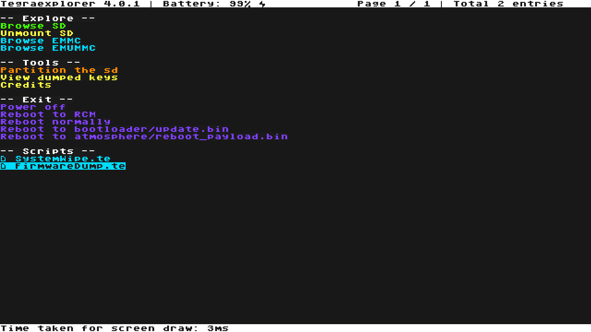
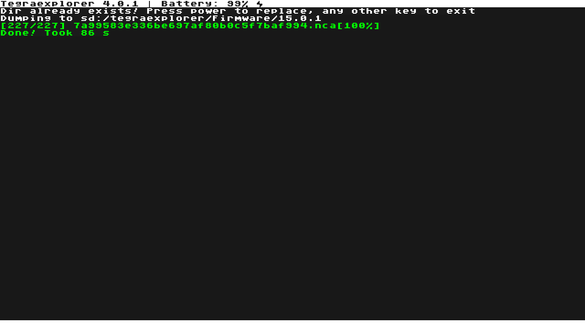
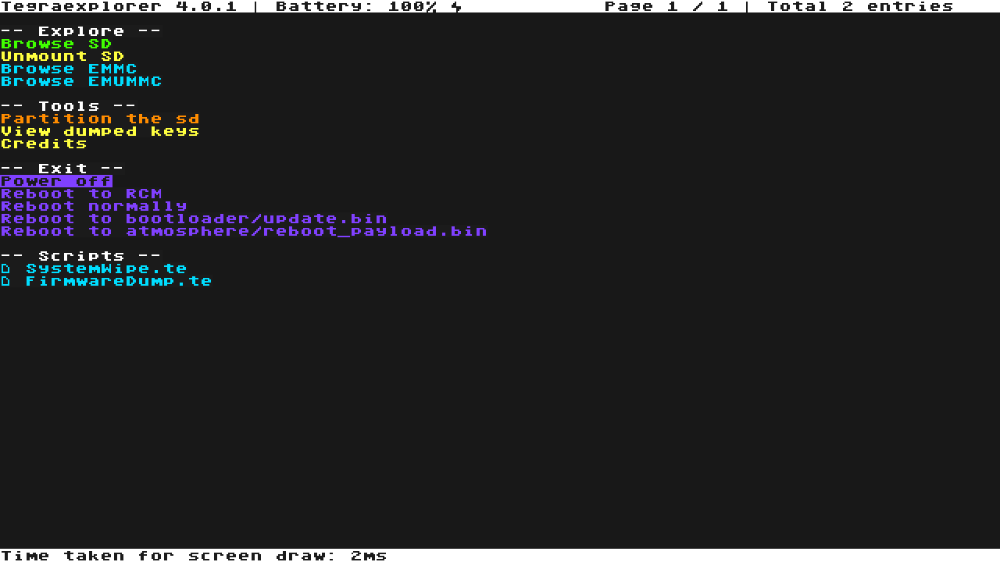

Thanks to Candy for providing the guide details & images. Loosely based off of [NH Switch Guide](https://nh-server.github.io/switch-guide/extras/updating/#updating-emummc-by-dumping-an-updated-firmware-from-your-sysmmc).

What you will need:
- The latest release of [TegraExplorer](https://github.com/suchmememanyskill/TegraExplorer/releases) (the `.bin` file)
---

1. Make sure your sysMMC is up to date. If your sysMMC is not up to date, update it through System Settings.

2. Boot your Switch into RCM.

3. Using a Payload Injector, such as TegraRcmGUI or fusee-interfacee-tk, inject the TegraExplorer.bin Payload (like you would with Hekate).

4. Using the joystick and the A buttons, select `FirmwareDump.te`.

5. Select `Dump sysmmc`.

6. Wait about 1-2 minutes for the tool to dump your firmware.

7. When the tool finishes, press any button.

8. Select `Power off`.

9. Remove the SD card from your Switch, and insert it into your PC.

10. A folder containing your firmware should now exist at `/tegraexplorer/Firmware/<version-number>`

