This article assumes you have already **[hacked your Nintendo Switch](https://nh-server.github.io/switch-guide/)** and **[dumped your Nintendo Switch keys](../keys)** (prod.keys) and firmware file(s).

This guide also illustrates how to use an untrimmed game cartridge dump (XCI file) to install firmware directly to Ryujinx. If you would prefer to dump the firmware standalone, you may follow this **[firmware dumping guide](firmware-dumping)**.

If you haven't already downloaded Ryujinx, get the latest version from the releases page.  
<!-- Ryujinx checks for updates automatically at startup. You can disable this feature in *Options > Settings*. You can also check for updates manually by navigating to `Help > Check for Updates`. -->

## Preface
Ryujinx comes pre-optimized by default. If a particular menu option is not mentioned in this guide, it should be ignored and not changed unless directly instructed by Ryujinx staff.

***When requesting support on the Ryujinx official Discord server, you will usually be asked for your log file. With this in mind, Logging should be left at default settings (enabled) for everything except debug logs. Do not enable debug logs unless specifically instructed by Ryujinx staff.***

## System Requirements
In order to use *Ryujinx* your computer will need:

- At least 8GB RAM
- A GPU supporting OpenGL 4.5/Vulkan 1.2 or higher
- Your **prod.keys** and either your **[dumped firmware](firmware-dumping)** or game cartridge untrimmed XCI
- Your dumped Nintendo Switch games or homebrew
- OS: Windows 10.0.17134 or higher / macOS 12 / Any modern linux distribution (see dependencies)

Recommended **Baseline** (Native Resolution and Framerate):

- CPU: Ryzen 5 3600
- RAM: 16GB DDR4
- GPU: NVIDIA GTX 1060 6GB

## Dependencies
### Windows
- **Windows 10 RS4 (Redstone 4, version 1803) or newer** is required.
- Graphics drivers must be up to date.

### Linux
Run these commands in your terminal:

- Archlinux-based distros:  
    ```bash
    sudo pacman -S sdl2 openal
    ```
- Ubuntu-based distros:  
    ```bash
    sudo apt-get install libsdl2-2.0 libsdl2-dev libalut-dev
    ```
- Fedora:  
    ```bash
    sudo dnf install SDL2-devel openal-soft
    ```

### macOS
- macOS 12 Monterey or later is recommended.

## Initial Setup

### Placement of prod.keys

By default Ryujinx will use `%appdata%/Ryujinx` (or the equivalent application data folder on Linux/macOS) to store all of it's permanent files. This includes firmware, save files, shader caches and other configuration. If you wish Ryujinx to be fully self-contained you may use [portable mode!](#portable-mode)


1.  Now that you've downloaded the *Ryujinx* archive, open it and
    extract the contents of the publish folder onto your drive in
    the location of your choice. We recommend against using your desktop 
    or the root of any drive as these can sometimes be protected.

2.  Navigate to where you extracted the *Ryujinx* files, and
    double-click on `Ryujinx.exe`. This will launch the emulator and you
    will be met with the following message (don't worry; this is
    normal!)  
    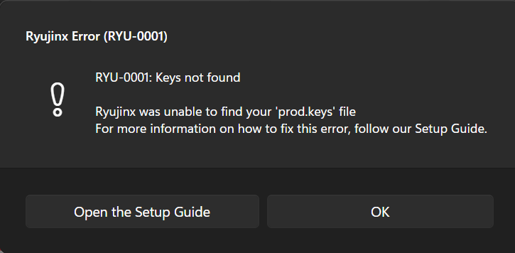

3.  Click *OK* on the warning box.
    Now that *Ryujinx* has been launched, the proper folders have been
    created for you in your `%appdata%` folder.

4.  Click *File* at the top left of the *Ryujinx* window, and then click
    *Open Ryujinx* *Folder*.  
    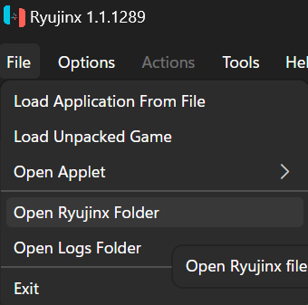

5.  Navigate down into the system subfolder and paste your prod.keys file
    here. The file/folder structure should look like this (JohnDoe
    substituted for your username):  
    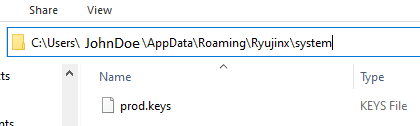

6.  Close and reopen *Ryujinx* so that the prod.keys file is validated. You're done installing keys!

### Installation of Firmware

Now that your keys are installed, it's time to install a firmware. Make
sure you have an untrimmed XCI file of a recent game cartridge you
dumped, or have compiled your [dumped firmware](firmware-dumping) into a ZIP file.

1.  Open *Ryujinx*. There should be no warning about KEYS.md anymore; if
    you still get the warning, go back through the prod.keys steps and
    ensure you have placed the file correctly.

2.  Now that *Ryujinx* is open, click *Tools > Firmware > Install from XCI/ZIP*.  
    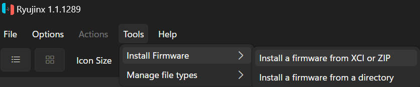
    This brings up the "Choose the firmware file to open" window.  
    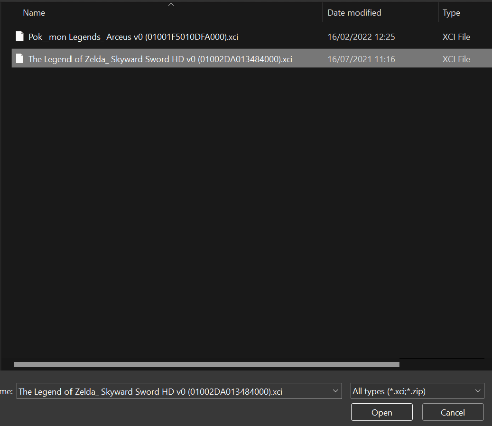


3.  Using the *Ryujinx* window, navigate to the location of your dumped
    XCI file and click *Open*. You will be asked to confirm whether you
    want to install the firmware. Make sure your prod.keys are at least
    as new as the firmware you are installing!  
    *(Your firmware version number may vary)*
    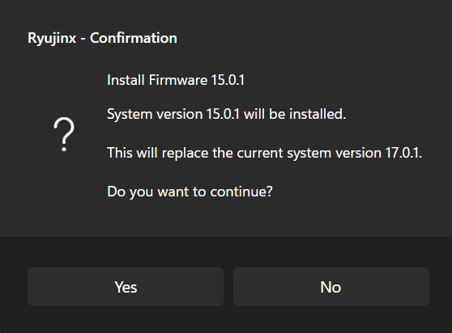


4.  Click *Yes*. You will see a message that the firmware is
    installing and was successfully installed.  
    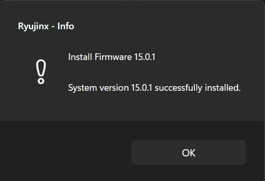


5.  Click *OK*. If all went well, you will now see your firmware version
    listed as the "System Version" in the bottom right hand corner of
    the main *Ryujinx* window.  
    

## Adding Your Games to Ryujinx

You have keys and firmware ready to go. Time to add your games!

With *Ryujinx* open, click on *Options > Settings*. This takes you
straight to the *General* tab.  
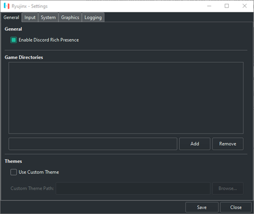

There are two different methods in which you can add a Game Directory in this window.

### 1st Method
Type the absolute path of the folder containing your games into the path
field and click *Add*.  


### 2nd Method
Without typing anything into the path field, click *Add*.  
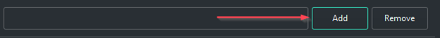

This brings up the navigation window. Navigate to the folder containing your games (e.g. `D:\Switch Games`) and click *Add*.  


1. Whichever method you chose, **click *Save*** to save the game directory setting.

2. Your games will now show up in the main *Ryujinx* window.  
   

## Managing Game Updates

Manage game update versions from within Ryujinx

Now that your games are added, you may wish to update your game for
various reasons e.g. bugfixes, new content, etc. *Ryujinx* has built-in
functionality to manage which version of the game you want to play.

1.  In the main *Ryujinx* game list right-click the game you want to
    apply an update to. Then click *Manage Title Updates*.  
    
    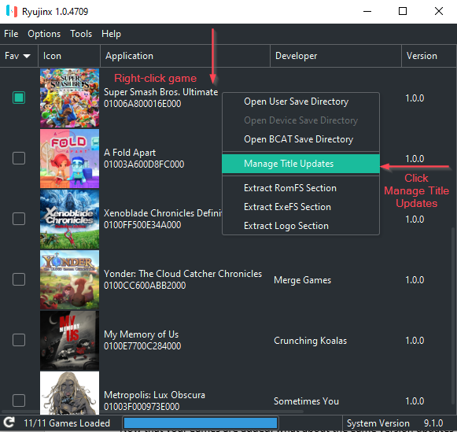
    
    After clicking *Manage Title Updates*, you will see the *Ryujinx --
    Title Update Manager* menu.

2.  In the *Ryujinx -- Title Update Manager* menu, click *Add*.  
    

3.  Clicking *Add* will bring up the navigation menu. Navigate to the location 
    of your game's update files and select update you want to add to *Ryujinx*, 
    and click *Add*.  
    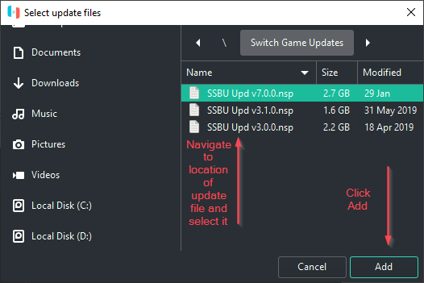

    This will bring you back to the *Ryujinx -- Title Update Manager*
    window. You may repeat this for any other game version update files
    you wish to add to *Ryujinx*.

1.  In the *Ryujinx -- Title Update Manager* window, select the version
    of the update you wish to be applied to the game and click *Save*.  
    

2.  Verify that the proper version number is shown in the main *Ryujinx*
    games list window.  
    
    
    Your game update has now been applied, and you may repeat the
    process for any other games you wish to apply updates to.

## Managing DLC

Manage Downloadable Content for your games

Some games have downloadable content available that you may wish to add
to your game. *Ryujinx* has built-in functionality to add & manage your
DLC.

1.  With *Ryujinx* open, right-click on the game you want to add or
    manage DLC for and click *Manage DLC* to bring up the *Ryujinx - DLC
    Manager* window.  
    

2.  Within the *Ryujinx -- DLC Manager* window, click *Add* to open the
    DLC navigation screen.  
    

3.  Navigate to the location of the DLC file(s) you wish to apply, then
    double-click the file to automatically add it. Or you may select the
    file or files, and click *Add*.  
    **Note: you may add more than one DLC file at a time!**
    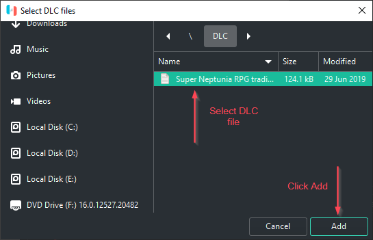

4.  You will now see your DLC in the *Ryujinx - DLC Manager* window.
    **Click *Save*** to save your configuration.  
    
    
    **Note: always drill down to see the proper status of the DLC .nca file you are managing. Checking and unchecking the .nca file is the way to enable and disable the DLC. The parent container (.nsp file) shows unchecked by default, even if the DLC is enabled.**  

Repeat this process, if you wish, for any other games you would like to manage DLC for.

## Managing Mods 
Quick Start Guide for managing mods

Various game mods are available from enthusiasts & content creators online. *Ryujinx* supports the following types of mods:

1. ExeFS Partition Replacement  
2. ExeFS File Replacement
3. ExeFS Patching
4. RomFS Partition Replacement
5. RomFS File Replacement

**For an in-depth explanation of the mods implementation & advanced usage options in *Ryujinx*, check the description in the original PR [here](https://github.com/ryujinx-mirror/ryujinx/pull/1249)**.

To enable mods:

1.  With *Ryujinx* open, right-click on the game you wish to manage mods for and click *Open Mods Directory*.  
    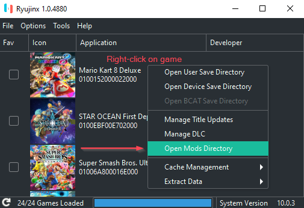

This will open the `AppData\Roaming\Ryujinx\mods\contents\<game ID>\` folder.

2.  Create a subfolder under the game id folder with an appropriate name conveying the mod you will be using. For instance, you might name the folder "Lana" if you were using a mod to add a Lana skin to Mario Kart 8 Deluxe.  
    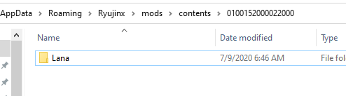

3.  Copy your mod's romfs folder or exefs folder into the new folder you created.  
    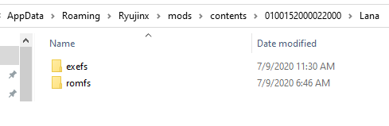

Mods can also be placed in the `AppData\Roaming\Ryujinx\sdcard` folder if the mod has been packaged for real hardware (usually indicated with an "atmosphere" folder as the top directory). With *Ryujinx* open, right-clicking on the game you wish to manage SD mods for and clicking *Open Atmosphere Mods Directory* will open the `AppData\Roaming\Ryujinx\sdcard\atmosphere\contents\<game ID>` folder where the romfs/exefs folders are located.  


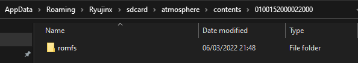

## Managing Cheats

Ryujinx now has native cheats/runtime mods support!  
It implements full support Atmosphere style cheats (except game pausing/resume): 
[Atmosphere Cheats](https://github.com/Atmosphere-NX/Atmosphere/blob/master/docs/features/cheats.md)

## Installation of Atmosphere Cheats

A good place to acquire Atmosphere cheats is:

- [WerWolv's EdiZon Cheats](https://github.com/WerWolv/EdiZon_CheatsConfigsAndScripts/tree/master/Cheats) (general switch cheats)

Inside the cheat `zip`, `rar`, or other archive format, there is usually a file structure like this:

```
Cheat_Name\cheats\0123456789ABCDEF.txt
```

Where `0123456789ABCDEF` will vary according to the game and the cheat (this is the build id of the executable the cheat attaches itself to). A cheat can also contain several `txt` files.  

**Cheats are game-specific and version-specific, they will not work if transferred from one game to another or to an incompatible update of the game.**

To install the cheat: 

- Open Ryujinx, right-click the game you wish to install the cheat and select to open its `Mod directory`;
- A directory like this will open: `Ryujinx\mods\contents\XXXXXXXXXXXXXXXX\`, `XXXXXXXXXXXXXXXX` will be the id of the chosen game;
- Extract the cheat archive to the mod directory, keeping the cheat name: `Ryujinx\mods\contents\XXXXXXXXXXXXXXXX\Cheat_Name\cheats\<all the txt files>`.

## Activating/Deactivating cheats

Currently, all cheats are automatically enabled and cannot be disabled, so mixing, for instance, 60, 90 and 120 fps cheats may cause a conflict. 

One alternative is to create a directory `disabled_cheats` in the mod directory and move all unused cheats there. Another one is to prepend something to the file name, for instance `off_0123456789ABCDEF.txt` as a valid cheat must not have anything but `0123456789ABCDEF.txt` in its name.

The .txt files can also contain several cheats that may conflict. To switch off individual cheats inside a .txt file first **backup the .txt file** to something like `bak_0123456789ABCDEF.txt` (this will also prevent the backup to be loaded as a cheat). Next, in the .txt file, there will be sections, each with a name within `[ ]` brackets and filled with sequences of letters and numbers (the code of the cheat), for instance:

```
[New Super Mario Bros. U Deluxe]

[Start with 99 Lives]
58000000 00CC9860
78000000 0002A1C0
61000000 00000000 00000063

[Time = 999]
58000000 00C88A70
78001000 00000090
64000000 00000000 003E6F00

[Start as Penguin]
58000000 00CC9860
78000000 0002A1C4
61000000 00000000 00000005
```

To disable the time cheat, just remove its section and the code:

```
[New Super Mario Bros. U Deluxe]

[Start with 99 Lives]
58000000 00CC9860
78000000 0002A1C0
61000000 00000000 00000063

[Start as Penguin]
58000000 00CC9860
78000000 0002A1C4
61000000 00000000 00000005
```

## Managing User Profiles

Ryujinx offers the ability to use multiple, customizable user profiles. **WARNING:** Save data is specific to each user profile so if you delete a profile, the save data under that profile is also deleted.

### Edit a user profile 
1. With Ryujinx open, but no game running, click on *Options > Manage User Profiles*  
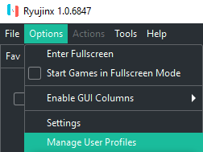

Now in the Manage User Profiles window, you will see the default RyuPlayer profile. This is the default profile that comes with Ryujinx and **cannot be deleted** as it contains all of the original save data for your games. You may, however, rename it and change the picture to something else, if you like.  
  

2. To rename a profile, simply select it and type in the new text.  
  

3. To change the profile image, select the profile in the list and click **Change Profile Image**.  
  

You will then be prompted to select from either a custom image, or from one of the many avatars provided in the firmware.  


If you choose to import an image: supported formats are `png`, `bmp`, and `jpg`. You can use the image you want, but it will be resized to 256x256 pixels, so using a square image is recommended.

If you choose to use a built-in firmware avatar, click on **Select Firmware Avatar**  

In the Manage Accounts - Avatar window, select the avatar you want, and choose a background color. When finished, click **Choose** to make it the profile's image.


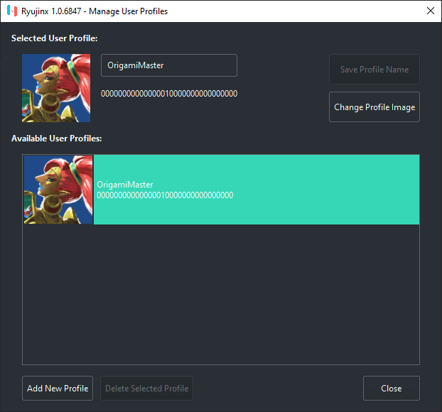

### Add a new profile

1.  With Ryujinx open, but no game running, click on *Options > Manage User Profiles*  
    

2.  Click on the **Add New Profile** button at the bottom left corner of the window.  
      

3.  A window will pop up asking you to name the new Profile. Enter the desired name of the new profile, and click OK.  
    

4.  You will now be prompted to choose the profile image. Follow step 3 from the user profile editing instructions above.  
    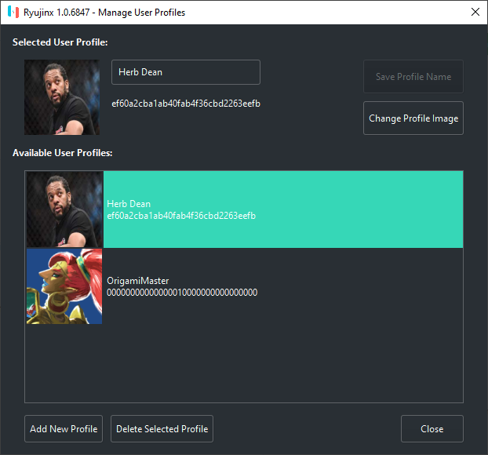

That's it!

## Input Configuration

Setting up your controls: this part requires close attention, so read
carefully!

1.  Plug in the controller(s) that you will be using.

2.  Open *Ryujinx* and navigate to *Options \> Settings*  
    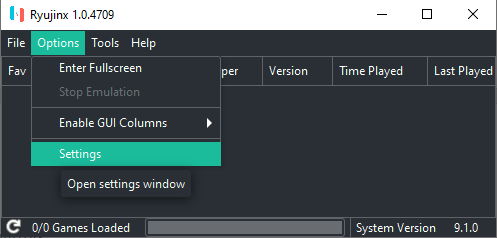

3.  You will now see the *Ryujinx - Settings* window. Click on the
    *Input* tab.  
    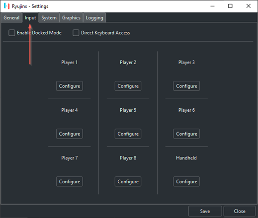

    Before proceeding to configure anything, the options on the Input page
    need some explanation:

    *Direct Keyboard Access*:  
    Checking this box emulates a real, physical
    keyboard being directly connected to a Nintendo Switch via USB. ***Do
    not check this box unless you have a specific reason***

    *Enable Docked Mode*:  
    Checking this box emulates the Nintendo Switch
    being docked. Docked Mode enables higher resolution, higher FPS, and
    better graphical fidelity on games that support these features.  
    **If you check this box, you will need to click configure under Player 1 (top left menu item).**  
    **If you leave this box unchecked, you will need to click configure under Handheld (bottom right menu item)**


1.  Click *Configure* under *Player 1* if you have enabled *Docked
    Mode*, or click configure *Handheld* if you have not enabled *Docked
    Mode*.  
    

2.  You should now be in the *Ryujinx -- Controller Settings* screen.
    Click on the *Input Device* dropdown and choose the *Xinput
    controller*. If you have connected multiple controllers, choose the
    one you want to be configured to be P1 in game.  
    **If you do not see any Xinput controllers in the list, you will need to use an Xinput wrapper/translator such as [x360ce](https://www.x360ce.com/).**  
    
    

1.  After selecting your Xinput controller you should now see a full
    mapping UI. If you want to map the buttons in a standard
    Xinput-compatible fashion, there is no need to individually map the
    buttons. Simply click on the empty *Profile* dropdown, select
    *Default*, and click *Load*. This populates the buttons with preset
    mappings for your Xinput-compatible (or Xinput wrapped/translated)
    controller. Otherwise, click on "*Unbound*" for each button you want
    to map, then press the actual button on your controller that you
    want for the Nintendo Switch controller button you've
    chosen.  
    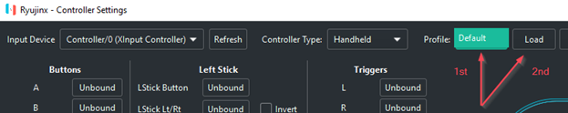
    
    You may continue tweaking the settings to your liking, or binding
    each button from scratch if you want a fully custom button layout.
    **NOTE: while the default *Deadzones* are 0.10, we recommend
    increasing your *Deadzones* to at least 0.20 in order to avoid
    unwanted joystick drift.**

If you are in *Docked Mode* and have additional controllers to
configure, configure them now under Player 2, Player 3, and so on.

7.  ***Click Save to save your configuration.***

Alternately, you may skip the input UI and edit your config.json file
found in `%appdata%\ryujinx\`

## Motion Controls
### Motion Controls

Ryujinx offers the ability to use motion controls with motion-enabled controllers such as a Switch Pro Controller, Joycons, Playstation DS4, smartphones with motion support, Steam controller, and others.

To use motion controls in Ryujinx:

1.  Launch & configure your favorite cemuhook server application (Betterjoy, DS4Windows, Steam Gyro, etc.) with your bluetooth or wired motion-enabled controller. Leave the application running.

2.  In Ryujinx, navigate to *Options > Settings > Input* tab and select which controller you are configuring. Remember: if you are in docked mode, configure Player 1. If you are in Handheld mode, configure the Handheld controller.  
    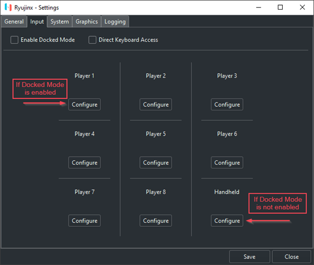

3.  Select your motion controller from the dropdown. It will be listed as "Xinput controller".  
    

4.  Configuration options:

   -  If you have already configured your controller's input buttons to your liking and only need to configure motion controls, check the "Enable Motion Controls" box and fill in the following information:  

    **Controller Slot:** the controller slot # your motion controller is configured as in your cemuhook server application. Default is "0"  
    **Gyro Sensitivity:** 100% (you may adjust this to suit)  
    **Server Host:** the IP address of the computer being used to host the cemuhook server. 127.0.0.1 is localhost/the same computer running Ryujinx.  
    **Server Port:** 26760  

    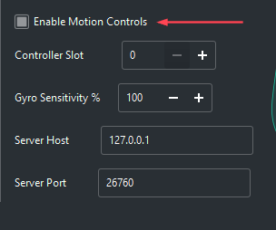

   -  Alternately, you can simply click on the empty Profile dropdown, select Default, and click Load. This populates the buttons with preset mappings and also fills in the motion control settings with recommended defaults. You may continue tweaking the settings to your liking, or binding each button from scratch if you want a fully custom button layout.

    **NOTE: while the default Deadzones are 0.10, we recommend increasing your Deadzones to at least 0.20 in order to avoid unwanted joystick drift.**
    Make sure to check the "Enable Motion Controls" box!  

    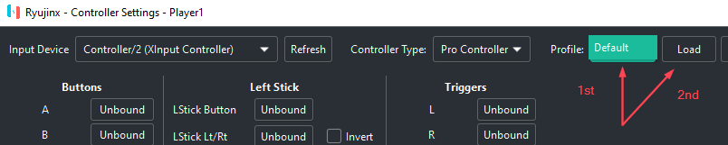

   -  Paired Joycons extra options:

    If you set your controller type to Joycon Pair, an option called "Mirror Input" becomes available. This is useful for games in which both Joycons are connected to a Joycon grip and are moving together. If you enable this checkbox, the first Joycon's motion will be used for both Joycons.  

    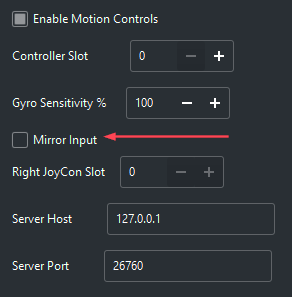


5. Click Save to save your configuration.

Repeat steps 2 through 5 for any other motion controllers you wish to configure. If you have more than one, make sure to choose the respective slot # for each controller!

## Amiibo Emulation

All Amiibo are able to be virtually scanned within the emulator, as long as you are actively connected to the internet. No files or dumps are required!

**To scan an Amiibo:**

1.  While playing a game that supports Amiibo, either navigate to the area where Amiibo scanning is expected, or press/hold the correct button to enable the Amiibo scan prompt. This site has a basic list of supported games and what benefits are provided by each: [https://amiibo.life/games]()  

2.  Click the "Actions" menu header, then click "Scan an Amiibo"  
      

3.  Choose the Amiibo you want from the Amiibo Series and Character dropdowns. Note: only the Amiibo that have content for the game you are currently playing are shown in this window. All the same, if you'd like to see all Amiibo you may check the box that says "Show All Amiibo".  
    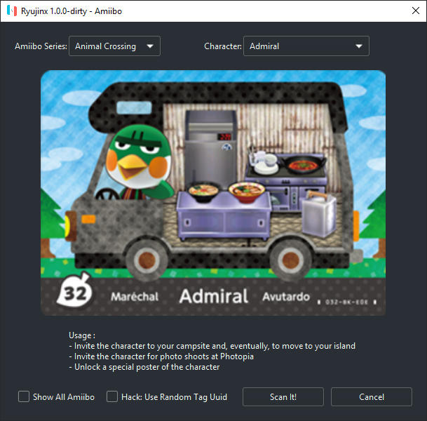  

**Addendum:** In The Legend of Zelda: Breath of the Wild, you may continually scan Amiibo as many times as you wish by checking the box labeled "Hack: Use Random Tag Uuid" box.

## Profiled Persistent Translation Cache

Speed up game loading times with PPTC

In a nutshell, this feature caches translated functions so that they do
not need to be translated every time the game loads. This results in a
significant reduction of load times \--the amount of time between
launching a game and arriving at the title screen\-- for nearly every
game.

**NOTE: You must launch the game at least twice and let it load**
**to the title screen or beyond before performance improvements are**
**unlocked on the third launch! These improvements are permanent and do**
**not require any extra launches going forward.**

PPTC (Profiled Persistent Translation Cache) is now enabled by default. To disable it:  

1.  With *Ryujinx* open, click on *Options \> Settings*  
    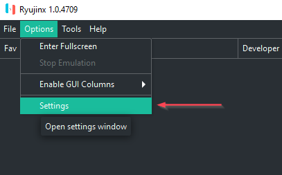
    

2.  Then navigate to the *System* tab and **uncheck the box** marked
    *Enable Profiled Persistent Translation Cache*  
    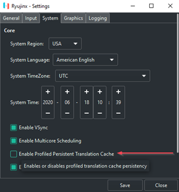

From time to time you may wish to examine or purge your PPTC cache files if you are experiencing PPTC-related issues.

To open the PPTC cache file location:  

1.  With Ryujinx open, right-click the game in the game list whose PPTC cache files you wish to view. This will bring up a pop-up menu.

2.  Navigate to *Cache Management > Open the PPTC directory*  
    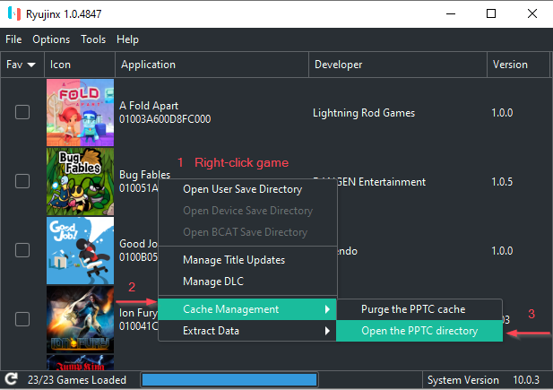

To purge the PPTC cache files:  

1.  With Ryujinx open, right-click the game in the game list whose PPTC cache files you wish to purge. This will bring up a pop-up menu.

2.  Navigate to *Cache Management > Purge the PPTC cache*  
    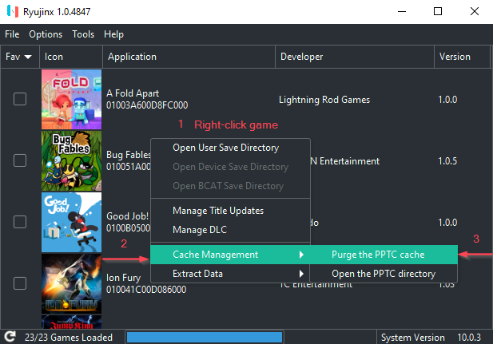

## Graphics Enhancements

*Ryujinx* offers a few graphics enhancement options.

1. *Resolution Scaling*, which offers a much sharper image with little to no impact to performance. Resolution scaling can increase image quality much more noticeably than Anisotropic Filtering. Ryujinx's resolution scaling implementation allows native, 2x, 3x, 4x, or even custom ratios for upscaling.

2. *Anisotropic Filtering*, which can visibly improve graphic quality. [Wikipedia says](https://en.wikipedia.org/wiki/Anisotropic_filtering):  
*In layman's terms, anisotropic filtering retains the "sharpness" of*
*a texture normally lost by MIP map texture's attempts to avoid*
*aliasing. Anisotropic filtering can therefore be said to maintain crisp*
*texture detail at all viewing orientations while providing fast*
*anti-aliased texture filtering.*

3. *Shader Cache*, which stores onto disk the shaders that have already been compiled, negating the need to compile them again. This feature is highly sought after as it significantly reduces stuttering and FPS drops on subsequent plays of a particular game making for a smoother, more enjoyable gameplay experience. **Note: Shader Cache is enabled by default.**

4. *Aspect Ratio Options*, which allow you to adjust the width-to-height ratio to your liking. **Note: these options may give your game a stretched or squeezed appearance unless you are using mods that change the expected aspect ratio of the game.**

### Enable Resolution Scaling

**Note: Enabling this feature may cause graphical glitches on some games.**  
**These settings may be changed in-game on the fly!**  
**On a standard 1080p display, 2x resolution scaling is recommended.**

1.  With *Ryujinx* open, click *Options \> Settings*  
    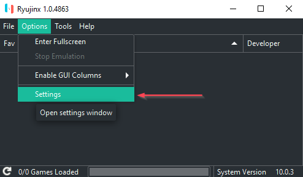
2.  Navigate to the *Graphics* tab and click the dropdown next to Resolution Scale. Select your desired level of resolution scaling.  
    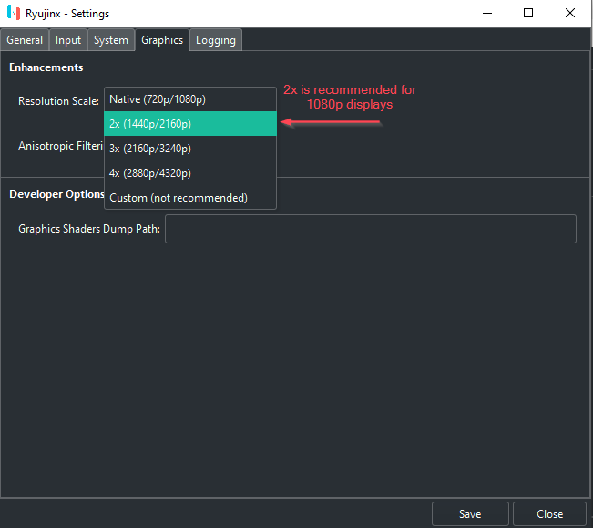
   
    **Click *Save*** to save the enhancement setting.

### Enable Anisotropic Filtering

**Note: enabling this feature may cause graphical glitches on some**
**games.**

1.  With *Ryujinx* open, click on *Options \> Settings*  
    
    

2.  Navigate to the *Graphics* tab and click the dropdown next to
    *Anisotropic Filtering*. Set it to your desired level.  
    
    
    **Click *Save*** to save the enhancement setting.

### Manage shader Cache

**Shader Cache is enabled by default**. There are no good reasons to disable it other than for testing purposes. 

Disabling this setting is strongly discouraged. However, if you absolutely must disable it:  

1.  With Ryujinx open, navigate to *Options > Settings*.

2.  Navigate to the Graphics tab and disable shader cache by unchecking the box marked "Enable Shader Cache"

    In some rare cases, a shader cache might become corrupted and crash when compiling shaders on boot. To solve this you'll have to purge the shader cache for that particular game. Right click on a game in the game list and navigate to Cache Management > Purge Shader Cache.  
    


To view the shader cache directory for a particular game:  

1.  Right click on a game in the game list and navigate to Cache Management > Open Shader Cache Directory.  
    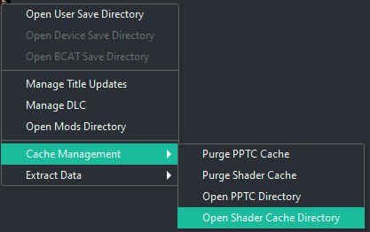

### Adjust aspect ratio

#### Method 1
With Ryujinx open, navigate to *Options > Settings* and click on the Graphics tab. Click on the Aspect Ratio dropdown and adjust the ratio to your liking.  


#### Method 2
With your game running, click on the aspect ratio button in the status toolbar at the bottom of the Ryujinx window.  
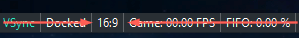

#### Method 3

1. Use Option 1 and select "Stretch to Fit Window" or Option 2 and select "Stretched".
2. Simply click and drag your window borders to the size you want!

## Portable Mode

If you wish, you may use a custom folder location for all Ryujinx data (as opposed to keeping it in its default location: `%appdata%`). This is done via the command-line or, more conveniently, a custom shortcut. In the future, the ability to configure custom data folders may be added to the GUI.

**NOTE: You must manually create the custom folder first before using portable mode! After enabling portable mode, you will need to copy your prod.keys file and any desired game data/save data from its original location to the new data folder.**

### Enable *Portable Mode*  

### Method 1: Create a "portable" subfolder 

**Recommended method**

Create a subfolder in the Ryujinx program base directory called `portable`. This automatically enables portable mode and utilizes this `portable` folder for system folder contents (keys, firmware, PPTC/shader caches, etc.).  
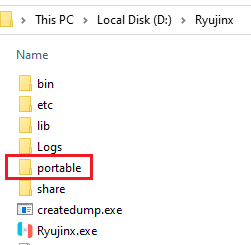

### Method 2: Command-line

Open a command prompt, navigate to the location of the Ryujinx executable and type the following command: `ryujinx.exe -r D:\[folderpath]`. For example, if your custom folder was `D:\ryujinxdata`, your command would be the following:  
```
ryujinx.exe -r D:\ryujinxdata
```


The command prompt window will become the console window when Ryujinx launches.

### Method 3: Custom Shortcut

1.  Right-click on your Ryujinx executable and click Send To -> Desktop Shortcut

    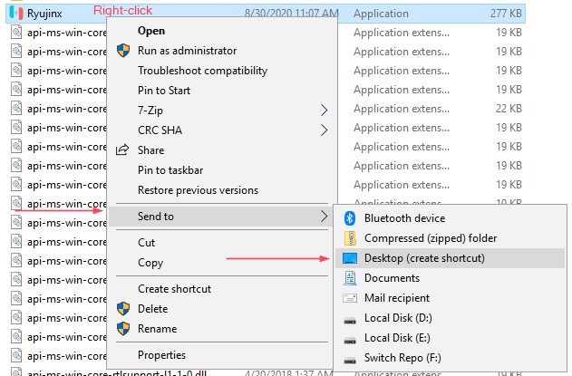

2.  Locate the new shortcut on your desktop and right-click on it, then click Properties

    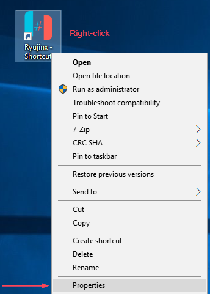

3.  In the Properties window, click into the Target field and add a space onto the end of the existing command. Then add `-r [folderpath]` where `[folderpath]` is your own custom data folder full path, and click OK.  
    For example, if your custom data folder was `D:\ryujinxdata`, the addition you would paste into the target field would be `-r D:\ryujinxdata`.

    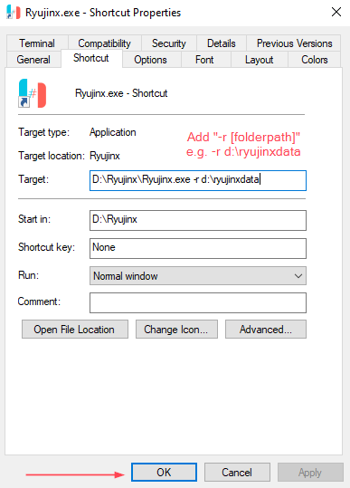

    On MacOS, the command would be `/Applications/Ryujinx.app/Contents/MacOS/Ryujinx -r /path/to/custom/ryujinx/folder`.  

    You can now use this shortcut any time you want to launch Ryujinx in portable mode!

## Launch in Fullscreen

Ryujinx can automatically launch games in fullscreen mode. You can enable this functionality in one of two ways:

### Method 1
In Ryujinx, click on Options, then check the box marked "Start Games in Fullscreen Mode".  
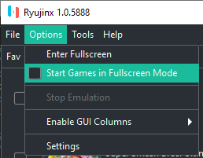

### Method 2
If you launch Ryujinx from the commandline, add a --fullscreen option. Like so:  
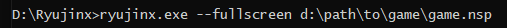